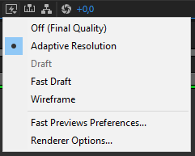
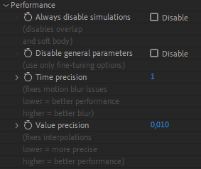

# How to improve After Effects and Duik performance

After Effects is a Digital Compositing Software. This means that the image displayed by the After Effects viewport is pixel-accurate. Its priority is image quality against performance;&nbsp;to the contrary of most animation applications, where you have to render the animation to get the final high-quality video, After Effects' goal is to let you work directly on the final image.

**After Effects is _not_ a character rigging and animation application.** Animating characters in After Effects is interesting though, thanks to it letting you work directly on the actual, rendered, animation. After Effects is very good at manipulating pixel assets (better than vectors), which makes it a decent software for cut-out character animation.

These last two decades, a lot of third-party tools were built on top of these features, specifically made for character animation;&nbsp;Duik was the first in 2008, followed by others (*Rubberhose*, *Joystick and Sliders*, etc.). Before that, there was no proper character rigging in After Effects, and it was fine. Duik and these other tools brought high-level rigging and animation to After Effects, and great films were made with this technique, but it also brought a lot of performance issues. The way a compositing application like After Effects work is not made for performance.

It is important to always keep in mind what is going to slow down After Effects when animating characters and props, to be able to organize your projects in a way to limit these performance issues, and adjust the settings of your tools accordingly.

## Choose the right tool

Honnestly, if you’re in some kind of very advanced rigging and animation project, if you’re in top-level quality and need both performance and versatility, After Effects may not be the right choice. Did you know [*South Park*](https://en.wikipedia.org/wiki/South_Park){target="_blank"} [^1] was made with [*Maya*](https://en.wikipedia.org/wiki/Autodesk_Maya){target="_blank"} [^2]? Why don’t you animate in [*Blender*](https://blender.org){target="_blank"} [^3] with a nice rig? You can rig 2D characters in 3D software, and you won’t have performance issues there.

But let's agree that sometimes, it’s easier and quicker to use less applications, to not have to render animations between different applications and to animate in the same software which will be used for compositing. In this case, Duik is the tool you need for character animation in After Effects.

!!! note
    Some explanations here might not be perfectly accurate about how After Effects works (there are caching systems and other tricks to improve performance we won’t explain here), but the point is to explain where to look at to improve performance.

## Summary

Here's a checklist of what you can do to improve the performance in After Effects, from most to less important. Read the next sections for detailed explanations about these suggestions.

- Set the preview quality to *Off&nbsp;(Final&nbsp;Quality)*. Don't leave it to *Adaptive&nbsp;Resolution*.
- Lower the preview resolution if you can (to *Half* or *Third*). Don't leave it to *Auto*.
- Hide, and shy, unnneeded layers.
- Hide the layer controls (`Ctrl + Shift + H`).
- Cut/hide all layers as soon as they're outside of the frame of the composition.
- Render or precompose (with a proxy!) the Shape Layers.
- Always precompose layers before duplicating them, if what you need is an exact copy.
- Bake expressions whenever you can, remove or deactivate unnneeded expressions (the ones which don't actually animate anything).
- Precompose the animated characters and props, and render proxies for them before compositing.
- Don't use essential properties.
- Use image sequences;&nbsp;Render to *openEXR* instead than *PNG*.
- Avoid the puppet tool.
- Restart After Effects every hour.
- Keep the After Effects project as small as possible.

Some tools are more compute-intensive than others. You have to know which ones to avoid or to optimize to fix performance issues in your rigs.  
You must know that Duik only uses native After Effects features, it automates things you could do by yourself (provided you have a lot of time to spend at it). This means it is not Duik by itself which causes performance issues, it is how native After Effects features are used together and how many of them at the same time.

Next is a non-exhaustive list of features you have to be careful with.

## Preview quantity and quality

This is not what will improve performance the most, but it’s measures you can take without making any compromise on the features of your rig. When animating, you can downgrade the quality of the preview, and the quantity of layers displayed.

Do you really need to display the [Bones](../guide/bones/index.md) and [Pins](../guide/constraints/pins.md)? Do Bones and [Controllers](../guide/controllers/index.md) really need anti-aliasing, or could they be set to draft mode? Actually, do controllers need to be shape layers or could they be simple nulls? Do all layers have to be vectors or could they be pre-rendered to an image format? These are the kind of questions you have to ask yourself.

There are a few options to speed up the preview and your workflow in After Effects.

- You can set the overall quality of the preview.  
    
  The default option, *Adaptive&nbsp;Resolution*, does not seem to be the best choice, as constantly changing the resolution of the preview when moving layers does not feel fluid at all. *Off&nbsp;(Final&nbsp;Quality)* does feel way more fluid when working, as does *Fast&nbsp;Draft*. There's actually not much difference between *Fast&nbsp;Draft* and *Off&nbsp;(Final&nbsp;Quality)*…

- You can change the resolution of the preview.  
    
  Again, the default one, *Auto* may not be the best for fluidity if you have this habit a lot of people have to constantly zoom in and out, to work details and have an overall look at the image, and if you don’t always do RAM previews at the same level of zoom. In this case, After Effects will be constantly rendering the preview at different resolutions and this has a very bad impact on performance and fluidity. It may be best to wisely choose a resolution and stick to it. Most of the time, when animating in HD or 2K compositions (or bigger), *Half* resolution or even *Third* is enough.

- You can change the quality of the preview per layer too.  
    
  In the attributes of the layer, clicking this icon will disable anti-aliasing and other algorithms which are not needed for animation, and this may improve performance a bit. Do the controllers really need the best quality?
- The quantity of layers enabled greatly impacts the performance of the user interface. Solo and shy the layers as much as possible, hide anything not needed. For this workflow, our other free tool [DuGR](https://rxlaboratory.org/tools/dugr){target="_blank"} [^4] can be a great help, and it is fully compatible with Duik. Read below for more information about it.

## Layers

The type of layers you use is of great importance to improve the performance. This table lists them from worst to best in termes of performance.

| Type | Notes |
| ---- | ----- |
| Complex Shape Layers | Shape layers with a lot of content or many expressions are the worst. |
| Simple Shape Layers | Very simple shape layers, with just a few shapes and without heavy expressions are much better, but are still a bit slower than raster layer to render. |
| Raster Layers | Raster layers (pixels, a.k.a. bitmaps) just need to be displayed, there's nothing to compute (except effects of course). |
| Null Layers | As they're empty, their impact on performance is negligible. |
| Simple Shape Layers, controls hidden | When  hiding layer controls (`Ctrl + Shift + H`), the performance is much better, for all  types of layers, except complex shapes. |
| Raster Layers, controls hidden | |
| Null Layers, controls hidden | As Null layers consist only of layer controls, hiding the layer controls means they don't have any impact on the performance (except for parenting and expressions in the transform properties) |

As you can see in this table, there are two ways to improve the performance of the viewport and the rendering performance in After Effects:

1. Always **hide the layer controls**.  
  This is by far **the best way to improve performance in After Effects** when manipulating layers.
  The option is available in the `View ▶ View Options...` menu in After Effects, and they can be quickly toggled with the `Ctrl + Shift + H` shortcut. You may have to do this quite regularly as its a per-composition option.
2. Always prefer **raster layers**.  
  A raster layer will almost always be **faster to render** than a shape layer. If you don't need to animate the contents of a shape layer, you could precompose it, or, even better, render it to an openEXR file and replace the shape with the rendered image.

!!! tip
    It seems the performance is a bit better (approximately 10&nbsp;%) with a shape layer containing many shapes than with everything exploded in several layers.

### Cut/hide invisible layers

Quite often, when animating some layers position, they may be (temporarily) outside of the frame of the composition. In this case, performance may be improved if you hide/cut them as soon as they get out, to be sure to prevent any rendering and evaluation of the expressions which are not needed as long as the layer can't be seen.

This is also true if for some time a layer is hidden beneath other layers, cutting it may improve performance.

### Render the Shape Layers

Every time you use a bézier shape, After Effects has to rasterize it before it can display it and render the composition. This means the more shape layers you have, the lower the performance will be. Whenever it's possible, you should precompose the shape layer, to the smallest composition you can: this way the precomposition is a raster layer, a bitmap with actual pixels, and faster to render. You can even render this precomposition to an image sequence to replace it or use it as a proxy. Proxies are great!

Of course, do not check the  *continous rasterization* option on the precomposition layer or you'll lose all benefits of the precomposition. Read the *Precompositions* section below for more information.

!!! tip
    A shape layer without animation nor expressions in its content should always be replaced by an image.  
    Especially when using the puppet tool! As it works with the rendered pixels and not with the vector data, you won’t lose quality, there’s no need to keep the vectors. And precomposing the shape will fix a lot of issues…

!!! tip
    Even if the shape layer uses expressions in its content, it can be a good idea to precompose it. This way, you could temporarilly freeze time on the precomposition layer to disable all expressions inside and improve the performance when animating, and only remove the time remapping to adjust details and render the final animation. You could also render a proxy of the precomposition to keep the final result while animating other parts.

**It is _NOT_ a good idea to use shapes hoping to be able to scale them.**

1. It will have a bad impact on performance, scaling is another step in the render process which takes some time. Especially if you have a lot of shape layers.
2. Scaling rigs is **very** complicated as it will probably break a lot of expressions.

Before working your animation, you should always draw a storyboard; this way you know which sizes are needed for your character and you can build a different rig for each.  
When you see only a close up on the torso and the head, do you really need the rig of the legs? When the character is far away, do you really need complex facial expressions? Will you even draw the character the same way?

If you’re using vectors only for scaling purposes, you can rasterize them (at a higher resolution if really needed) and greatly improve performance.

### Duik Bones

Duik [Bones](../guide/bones/index.md) are Shape Layers and thus have a bad impact on performance. This is not a big issue though, as they're not meant to be displayed; when hidden, their performance impact is negligible, especially if they're *baked*.

This being said, with all their [envelops](../guide/bones/envelops.md) and [noodles](../guide/bones/noodles.md), they quickly become complicated to manipulate. If you don't need these advanced features, you have the option to use simpler bones, displayed as small dots, which are much lighter.

Even when using these simpler bones, there are still a few expressions to control their appearance. To further improve performance, you can *bake* the bones to remove these expressions. By default, the bones are automatically baked when running the auto-rig.

▷ Read the [*Bones and Autorig*](../guide/bones/index.md) section for more information about these options.

### Duik Controllers

By default, Duik uses Shape Layers for controllers too. This enables the dynamic display of some guides and helpers directly inside the controller layer conotents, but, again, this has a bad impact on performance.

If you don't need these guides, there are two ways to avoid using shape layers as controllers:

- **Use raster layers** (*PNG* images imported into the project, or custom layers you've created).  
  In this case, you can still use a nice icon to identify the controllers, and you can hide the layer controls (`Ctrl +  Shift + H`) to achieve the best performance. If you'd like to customize the appearance of the controllers, like you would do with shape layers, you can use some simple effects, like the *transform* effect to move and scale the icon, and the *fill* effect to change its color. Even with these effects, the performance is better than shape layers.
- **Use null layers**.  
  Null layers have a great performance, but they're completely invisible if you hide layer controls, and can't be customized as nicely as standard layers. It's nice that they're automatically hidden when previewing an animation though.

When using raster layers or null layers as controllers, the performance of the rig is much better;&nbsp;but if you still want or need to use shape layers, you can also *bake* their appearance to make things a bit better.  
Shape layer controllers are automatically baked by default when *extracting* controllers from a precomposed rig.

▷ Read the [*Controllers*](../guide/controllers/index.md) section for more information about these options.

## Expressions

**Expressions in After Effects are all evaluated (computed) when rendering each frame of the composition**. This won’t be an issue if they are simple, with basic calculations like the vast majority of expressions you may write by yourself.  
Now, imagine an expression, which, when it is evaluated (i.e. at each frame of the composition), needs to compute previous movements of some other layers - this is what simulations do. This means it also needs to compute everything which influences the layers in previous frames of the composition, including other expressions, which might be complex too… This is a nasty situation where performance will drop dramatically[^cumulative].

**Some features of Duik use very complex expressions**, and compute-intensive calculations, like the IK which involves more maths than simple additions and multiplications, or simulations like the kleaner's follow-through which have to compute previous movements. Even if we’ve been hard at work to fix performance issues, in some cases combining a lot of expressions (i.e. Duik features) can lead to poorer performance when animating, or even so much lag that the rig cannot be correctly manipulated anymore.

!!! note
    Don’t worry about simple expressions you create manually, like links between properties, or simple wiggles, etc. They’re not a problem, even if you have hundreds of them.

When dealing with complex expressions, just remember that the more expressions = the more performance issues you’ll have.

In the end, expressions are *just animations* and could be replaced by keyframes to improve the performance.  
After Effects can bake the expressions to keyframes for you, with the `Animation ▶ Keyframe Assitant ▶ Convert Expression to Keyframes` menu entry. This creates one keyframe per frame, then deactivates the expression.

Duik can also help you with that:&nbsp;the [*bake expression*](../guide/automation/tools/) tool in the [*Automation and expressions*](../guide/automation/index.md) panel has two better ways to convert expressions to keyframes:

- A *smart mode* creates an animation as close as possible to the result of the expression, using just a few Bézier keyframes, and keeps the animation easy to edit later.
- A *precise mode* creates an animation  with as much keyframes as needed for a perfect match (which is still less than the After Effects native tool).

### Bézier paths and expressions

For some reason, **using an expression to control the Bézier path of a mask is much slower than the same expression in a shape layer**: if you need to use expressions with Bézier path, try to always use shape layers instead of masks! We've measure the same expression to be twice faster in shape layers.

## Compositions

The more complex a composition becomes, the slower it is to render; complex compositions with too many layers also have a really bad impact on the user interface of After Effects.

The less layers there are in a composition, the better it is.

- Hide layers you don't need to improve the rendering performance.
- The number of layers displayed in the timeline influences a lot the performance of the user interface. There are two ways to improve that:  
    - Use the *Shy Mode* to reduce the number of displayed layers.
    - Reduce the size of the timeline panel to display less layers at once. The timeline displayed vertically, with many layers, is very laggy, but the performance is much better with a horizontal timeline displaying only a few layers, even if the composition contains hundreds of them.

### Precompositions

Precompositions are an under-estimated way to improve performance.

Precomposing several layers reduces the number of layers displayed in the timeline and improves the performance of the user interface, and, used wisely, precompositions can greatly improve the rendering performance.

Each time you duplicate a layer, you have to ask yourself if you can precompose it first in any way and then duplicate the precomposition. Very often, you can precompose!

!!! tip
    Keep in mind that you can use expressions to link stuff from the precomposition to the main composition.  
    With the [*Parent accross compositions*](../guide/constraints/parent.md) tool of Duik, you can even parent a layer in a precomposition to a layer outside of it.  
    The [*Extract Controllers*](../guide/controllers/extract.md) tool can be of great help too.

When you precompose before duplicating the layer(s), all its transformation and effects will be rendered only once and only then they will be duplicated. Without precomposition, everything has to be rendered twice (or more if you duplicate again the same layer).

!!! warning
    If you enable the *continous rasterization*  option, you'll lose all benefits of the precomposition on the rendering performance, as After Effects will re-render all layers inside the composition each time it is used with the option activated.

#### Proxies

*Proxies* are a great way to improve the performance when using precompositions. By rendering the composition and using the rendered frames, you can bake lots of layers in your project, and if these proxies are full-quality openEXR files for example, you can even use the proxies for the final render in the end. By rendering proxies at each step of your work, you also save rendering time for the final render. Note that this also saves memory needed for the final render, and can help you deliver more complex projects even on lower-end computers.

#### Essential properties

When using a lot of precompositions, it may be tempting to use lots of essential properties. But essential properties must be avoided at all costs! Each time a composition uses at least an essential property, that means it has to be re-rendered instead of re-using the previous cached rendered image of the same composition. This also means it gets much more complicated to use proxies with these compositions...

Essential properties also have a lower performance than simple expression links; to control a property inside a precomposition, an expression will always be better. The difference may not be noticeable for a single property, but with lots of essential properties, the performance drops dramatically.

A few tools in Duik like [*extract controllers*](../guide/controllers/extract.md) have the option to use either expressions or essential properties. It is advised to use expressions whenever possible.

### DuGR, Layer groups

To handle lots of layers, we've developped another tool called [*DuGR*](https://rxlaboratory.org/tools/dugr) [^4]. By grouping layers, it makes it easy to isolate them, both in the timeline or the viewport (using solo and shy modes).

This helps to improve the performance in two ways:

- By reducing the number of layers displayed in the timeline, the performance of the user interface gets better.
- By creating simpler, schematic versions of your characters and props to be used during the animation process, you can use *DuGR* to switch between the simplified layers and the final render.

!!! note
    [Rafael Arame](https://www.artstation.com/rafaelarame/blog){target="_blank"} [^5] explains this very well in a [nice article](https://www.artstation.com/blogs/rafaelarame/YVZr/layer-management-a-solution-for-complex-rigs-in-after-effects){target="_blank"} about how he uses [DuGR](https://rxlaboratory.org/tools/dugr){target="_blank"} [^4] to improve the performance of his complex rigs, which you can read on [rxlab.info/rafael-dugr](http://rxlab.info/rafael-dugr){target="_blank"}.

## Project

Big projects can lead to a lot of issues. The number of items displayed in the project panel influences the performance of the user interface (try to keep the project panel as small as possible, and close folders). Big files are longer to read and write, and raise the probability of sync issues or corrupt files.

It is a good habit to animate a single shot per project; do not store everything into a single After Effects project! Try to keep the project files as small as possible, and regularly reduce the project to remove unused items.

The [sanity tests](../guide/sanity.md) included in Duik keep track of your project size and the number of items in it to help you keep it small.

### Project Settings

A few settings  can be tweaked per project to improve a bit the performance.

- `Video Rendering and Effects`  
  If you have a compatible GPU, you should always leave this option to use *Mercury GPU Acceleration*, unless you have rendering issues or GPU driver issues.
- `Expressions`  
   It is *said* that the new *JavaScript* engine is faster than the *Legacy ExtendScript* engine, but if that's true, it doesn't seem to be measurable. What's true is that some expressions may not work on both engines: some expressions may work only on the legacy engine whle others only on the JavaScript engine. All expressions used by Duik should be compatible with both engines, but sometimes switching the engine may fix some bugs. In doubt, always use the new JavaScript engine.

## Formats

Not all formats are equal. If you’ve understood what we wrote just above, you may be beginning to use more image formats and less shapes, whether it’s for proxies or final render. What formats should be used?

-  When rendering animations, most of the time it’s better and easier to use image sequences than video files. There is at least one very good and simple reason for it: if the render fails, you won’t have to start it all again, but just the remaining frames. If you want to change something in the animation, you will only have to render the corresponding frames.

- You should use a format which suits your needs (color depth, alpha channel), but also a format which is fast to read and write by After Effects! Our advice is to use *OpenEXR* (with *PIZ* (lossless) or *DWA* (slightly lossy) compression) which handles 32bpc, and has an alpha channel. It is also way faster to read/write than *PNG* in After Effects, and files are usually smaller with *EXR*. It’s better than the *RAW* format of your camera, it’s great for storing HDRi. Premiere and other editting software, as well as Photoshop, can read them; as specified in the name, they’re open and widely compatible. What more could you ask for?

!!! tip
    You can render the audio to a simple `*.wav` file stored next to the image sequence.

If you still prefer to use video files, you should choose a format which is also as fast as possible to read and write. Avoid *H.264* and *H.265* (*mp4*,etc.) and prefer *intra-frame* codecs like *Apple ProRes*, *Avid DnxHD*, or *Quicktime Animation*. Note that, although it's widely used, *ProRes* (and *DnxHD*/*DnxHR*) is a lossy codec which outputs huge files. *OpenEXR* sequences or *Quicktime Animation* are lossless (or optionally very slightly lossy if you wish even smaller files with *EXR*) and usually output much smaller files.

## After Effects

### Memory leaks

The most important thing to know about After Effects is that there are memory leaks. This means that the longer you use it, the more memory it will use, and part of this memory is completely wasted. This is especially true when using scripts, it is a known issue in After Effects that scripts are never freed from memory even if they're closed and have finished everything they're doing (the technical term is *garbage collection*, and this garbage collection just doesn't work for scripts). This clearly slows down After Effects after a certain amount of time and use. Until this kind of issues are all fixed, the only way to keep your app as fast as possible is to restart it regularly to completely free the memory. Even the `Edit ▶ Purge` menu is of no use about this issue.

### User Interface

It is a well-known fact that the user interface of After Effects, is, to say the least, sluggish... If there aren't too many items to be shown, it's usually okayish, but it quickly becomes a pain to navigate panels with a lot of items... Which is usually the case of the most important one, the timeline panel, with a lot of layers and keyframes. There's nothing we can do about that, and it's one of the main reason why you should learn animation in another application (like Blender) if you can.

This problem has another less-known implication: scripts are (very) slow. In After Effects, scripts run in the same thread as the user interface. This itself could be seen as a design flaw, although at the time this was designed, multi-threading was not the thing it is today. But the real problem is that when a script is running, there's no way to stop the user interface to *try to* follow. Each operation a script does, the user interface tries to reflect it. And the script has to wait for the user interface to finish this (slow) operation to continue onto its next step (because it lives in the same thread). Although the actual operation the script does could be very fast, it is slowed down by the user interface of After Effects. For example, a script creating a few dozens of new keyframes on some properties will be slowed down *for each keyframe creation* by the user interface actually showing the new keyframe (instead of waiting for the script to finish and draw them all at once). This would not be so much of an issue if the user interface wasn't so slow...

There's no solution here, except that now you know it, you can talk about it with Adobe.

### Preferences

Sometimes, changing a few options in After Effects can improve the performance or fix issues. In most cases, leaving the default values should work well, but it may be useful to have a look at these specific preferences:

- `Previews ▶ Viewer Quality`:  
    - Set the *Zoom Quality* to *Faster* or *More Accurate Except Cached Preview* to improve a bit the performance when the viewer zoom is not set at 100%. Note that the difference is hardly noticeable, but sometimes, every little improvement is good to have.
    - You can do the same for the *Color Management Quality* for color-managed projects.
- `Previews ▶ Cache Frames When Idle`:  
  This can also be toggled per composition in the `Composition ▶ Preview` menu.  
  Caching frames when After Effects is idle does improve the performance, as sometimes frames will already be cached when you start working on a composition. But with very long compositions this can cause lots of issues by filling your computer's memory. In this case, all your programs may start to behave erratically or even crash after everything begins to lag a lot.
- `Display ▶ Motion Path`:  
  Displaying too long motion paths can be very laggy, especially if the motion path is the result of complex expressions. Be careful with that;&nbsp;it may be better to deactivate completely the motion paths and enable them only when needed. Unfortunately, there's no shortcut for that, but Duik may include a button for that in the future.
- `Display ▶ Disable Thumbnails in Project Panel`:  
  This option doesn't really improve the performance, but again, sometimes with very big projects, every little improvement helps.
- `Media & Disk Cache ▶ Disk Cache`:  
  When the disk cache is enabled, After Effects will save rendered frames to a temporary location on a specified disk. This is needed if your system runs with low *RAM* memory. If you have a lot of available memory (more that 32 or even 64GB) when working with After Effects, it may improve performance to disable the disk cache: in this case, After Effects saves the frames only into RAM, which is much faster than any disk. But in this case, you'll lose all the cache when closing After Effects or restarting your computer, to the contrary of the disk cache.  
  A way to benefit from both worlds is to create a *Ram Disk*, read below for more information.
  No matter what, you should always choose a location on the fastest (SSD) possible disk on your system, separate from the disk containing your footage if possible.
- `Memory & Performance ▶ Memory`:
  Be careful with this option: due to the memory leaks explained in the previous section, the memory limit is not actually respected! It is easy to show that After Effects memory can be much higher than the limit set here, by just running a complex script (like Duik) a few times.
- `Memory & Performance ▶ Performance`:
  Using Multi-Frame Rendering usually improves performance, but in specific cases it may be better to deactivate this option: if you work with complex compositions, lots of expressions, or non-compatible effects, multi-frame rendering may actually slow down the rendering process:
    - It takes more time to start the rendering process when using multi-frame rendering. This can be a problem for previews:&nbsp;if you notice a long delay between requesting the preview and the render of the first frame, it may be because of multi-frame rendering and it's worth trying without it, then maybe enable it again just before the final render.
    - It may sometimes be actually slower to render than standard rendering, but that depends on what you're rendering. You'll have to test with your own project if you suspect it to slow down your renders, but that shouldn't be the case in the majority of projects. In doubt, leave it enabled.

## Duik features impacting performance

Some features in Duik are especially slowing down After Effects, it's best to know them and what you can do to improve performance with these specific features (or try to avoid them).

!!! tip
    Always have a look in the effects of the layers: in the effects created by Duik, there may be some performance options to adjust the balance between performance and quality (especially the quality of motion blurs).

!!! tip
    Some effects created by Duik have an option to adjust the precision of the motion blur. If you don't need motion blur on the layer, keep this to the lowest value, as it usually make the performance drop a lot. If you need motion blur, keep the value as low as possible to hide motion blur artifacts on fast movements.

    

!!! tip
    Cut the layers when they're hidden or out of the frame of the composition to make sure the expressions aren't evaluated when they're not needed.

### Parent constraint

The [Parent constraint](../guide/constraints/parent.md) is a great tool but… It can be very computer-intensive. To be able to compute the location of a layer, it has to compute the previous movement of all its parents for all the previous frames of the composition. This means the longer the composition is, the slower it will be. Avoid using it in very long compositions, and try to use it only when necessary. Often, it is easier and quickier to just split the layer when its parent must change.

The other constraint are much lighter, it's better to try to use the orientation or position constraint whenever possible instead of the parent constraint.

### IK

The IK used in a character like the ones created by the [Auto-rigger](../guide/bones/index.md) will not be a problem unless you have a lot of them, but there are a few tips to make them even lighter.

- When using shape layers as controllers, you can disable the guides on the controllers (the dashed lines representing the IK) in the effects of the controller. It's better to use raster controllers though (and in this case, there are no guides at all).

- When you deactivate the IK and animate in FK, the performance is usually better, and FK animation is actually easier than IK.

### Kleaner (simulated)

!!! warning
    Beware of the simulation

The default [Kleaner](../guide/automation/kleaner.md) automation should not be an issue most of the time. But beware of the simulation! As every simulations, it involves a lot more computation and can quickly become a reason why your rig won’t work anymore. Try to use simulations as few as possible, and keep in mind that most of the time, animating hanging hairs or the antenna of a car is quick and easy with a few keyframes without even using the Kleaner.

Simulation in the Kleaner happen only in multi-dimensionnal properties. You can completely disable simulations in the *Performance* section of the effect created by the Kleaner, as long as some other adjustment to further improve the performance according to your needs.

### Wheel (curved motion)

The default [*Wheel*](../guide/automation/wheel.md) automation is very light and won’t be any problem. But be careful with the *curved* mode, as it needs to compute the trajectory of the wheel on all the previous frames of the composition. At the end of a long composition, this can be very heavy.

### Motion Trails

As [motion trails](../guide/automation/motion-trail.md) have to generate bezier paths according to the movement of layers, if you have a lot of layers and parenting, this can lead to very poor performance, as a lot of calculations are needed. You can’t do much about it, except in some cases you can animate the trails by hand: copy the position keyframes into a bezier path, and use the “trim paths” tool in a shape layer.

If you don’t need variable width on the motion trail, make sure to keep the mode to *simple* instead of *advanced*. The simple mode is much lighter.

There are a few sampling option to adjust the balance between smoothness and performance.

The *Method* should be kept on automatic, except if for some unknown reason it fails to generate a smooth path.  
Try to keep the number of samples as low as possible, on the lowest value you need for the trail to be smooth.

### Other automations and expressions added by Duik

The other automations are not particularly heavy. Just be careful with automations like the [*Effector*](../guide/automation/effector.md) which is often used to drive a lot of layers together, which means it's a lot of expressions.

## Hardware

> What's the best hardware to use with After Effects?

If you ask this question around, everyone will have a different opinion. Here's what we've measured when developing Duik and other tools, and tested them on film productions.

### Disks

There are three important locations for your data when working with After Effects: 

1. The system, where After Effects is installed. These files are mostly read when After Effects is launched, and then used just very little.
2. The Disk Cache which stores the temporary rendered frames. This is the most used location.
3. Your media files (footages). These files are read regularly to render your compositions.

It doesn't really matter where you store the project files themselves (`*.aep`) as they're read/written only when loading and saving the files, and should not be very big files anyway.

The best case scenario is to have at least three big different physical disks, as fast as possible (SSD), for each of the aforementionned locations, but if you can't afford it, you can perfectly use just two disks:

- A disk as fast as possible for both the system and the disk cache: the system files are not used so often, so it's fine to store the disk cache on the same disk.
- Another disk to store your footage, which may be read at the same time the disk cache is read and written, so that will improve the performance to separate the footages. Note that the speed of this second disk is a bit less important, as the footages are mostly read and not written: it's always faster to read than write, and they're used a bit less than the disk cache.

Both disks needs to be quite big:&nbsp;the system disk will store your operating system and all applications, and it's more comfortable to have a large disk cache. The disk storing your footages (and rendered files) needs to be able to store a potentially large amount of medias.

It is not recommended to use a single disk, unless it's very fast (and big...).

!!! note
    Dividing a physical disk into several partitions does not improve performance, and may even slow things down.

### Memory (RAM)

The more, the better. Simple.

It's not the RAM which matters most, we've been able to use After Effects correctly with computers with only 8&nbsp;GB or even small laptops with 4&nbsp;GB (just remember you need to restart After Effects regularly to free memory). This being said, although everything will work well with as few as 8 GB, more RAM will always be useful if you can afford it.

With a lot of RAM (at least 32&nbsp;GB) you may even be able to disable the After Effects Disk Cache if you'd like, which may improve the performance, and protect your disks by limiting the number of write access to them.

#### RAM Disk

A RAM disk[^6] is a block of random-access memory (RAM, i.e. volatile memory) that a computer's software is treating as if the memory were a disk drive (secondary storage). RAM disks provide high-performance temporary storage for demanding tasks and protect non-volatile storage devices from wearing down, since RAM is not prone to wear from writing, unlike non-volatile flash memory.

The performance of a RAM disk is generally orders of magnitude faster than other forms of digital storage, such as SSD or hard disk. This performance gain is due to multiple factors, including access time, maximum throughput, and file system characteristics.

With more than 32 or 64&nbsp;GB, you could create a small *Ram Disk* to store temporary files or test projects which will be automatically erased when restarting the computer. This has proven very useful in our experience, even with RAM Disks as small as 2&nbsp;GB.

With at least 64&nbsp;GB RAM, you could create a *RAM Disk* of a few dozens of gigabytes to be used as the After Effects Disk cache. In this case, you'll keep the cache between After Effects sessions, as long as you don't restart the computer, and it will be as fast as possible, while protecting your physical disks by limiting the number of write access to them. But to do that you'll need at least 64&nbsp;GB of memory to keep enough standard RAM.

!!! note
    The RAM Disk can be activated only when you need it, and deactivated when you need your full amount of RAM.

#### Central Processing Unit (CPU)

That's the most important part for After Effects: it is used a lot when working and rendering the compositions. The faster, the better.

It seems that, given the choice, it's better to have less threads with a higher frequency than more slower threads (i.e. prefer *GHz* over *Cores*).

Note that the relation between the CPU capabilities and After Effects performance doesn't feel linear: a CPU twice faster will not result in After Effects being twice faster, but just *a bit* faster. Anyway, After Effects is always too slow, so if you plan to work in After Effects, try to spend your money mostly on the CPU.

#### Graphical Processing Unit (GPU)

After Effects does use the GPU more and more to render the effects and compositions, so it's a good idea to use a good GPU. Of course, if you're working with 3D, you'll need a high-end GPU anyway, but if you're only working with After Effects, 2D, and video, it's not useful to have the best GPU, a mid-level GPU is enough.

[^1]: *South Park* is an American animated sitcom. The series revolves around four boys—Stan Marsh, Kyle Broflovski, Eric Cartman, and Kenny McCormick—and their exploits in and around the titular Colorado town. It became infamous for its profanity and dark, surreal humor that satirizes a large range of subject matter. *cf.* [en.wikipedia.org/wiki/South_Park](https://en.wikipedia.org/wiki/South_Park){target="_blank"}

[^2]: *Autodesk Maya*, commonly shortened to just *Maya*, is a 3D computer graphics application. It is used to create assets for interactive 3D applications (including video games), animated films, TV series, and visual effects. *cf.* [en.wikipedia.org/wiki/Autodesk_Maya](https://en.wikipedia.org/wiki/Autodesk_Maya){target="_blank"}

[^3]: *Blender* is a free and open-source 3D computer graphics software tool set used for creating animated films, visual effects, art, 3D-printed models, motion graphics, interactive 3D applications and virtual reality. *cf.* [blender.org](https://blender.org){target="_blank"}

[^4]: *DuGR* lets you group layers in After Effects, and isolate the display of these groups. It is an essential tool to simplify the management of compositions with lots of layers, without any need to precompose! *cf.* [rxlaboratory.org/tools/dugr](https://rxlaboratory.org/tools/dugr){target="_blank"}

[^cumulative]: Because there's no way to reliably store any data with expressions in After Effects, expressions depending on previous values of the same property (cumulating the values) actually have to re-compute everything for each frame of the composition. This means that for each frame, they need to add up all previous values. The total number of values to be computed for a given composition is a [*triangular number*](http://en.wikipedia.org/wiki/Triangular_number) (see [en.wikipedia.org/wiki/Triangular_number](http://en.wikipedia.org/wiki/Triangular_number)) given by the formula `(f² + f) / 2` where `f` is the number of frames in the composition. Because of the `f²` in the formula, this number grows very fast with the duration of the composition.

[^5]: Rafael Arame is a recognized After Effects rigging expert. You can have a look at his blog on [www.artstation.com/rafaelarame/blog](https://www.artstation.com/rafaelarame/blog){target="_blank"}.

[^6]: A quick search will let you find several utilities to easily create RAM disks both on *Windows* or *MacOS*. [Read this *Wikipedia* article](https://en.wikipedia.org/wiki/RAM_drive){target="_blank"} for more information about RAM Disks: [en.wikipedia.org/wiki/RAM_drive](https://en.wikipedia.org/wiki/RAM_drive){target="_blank"}.

