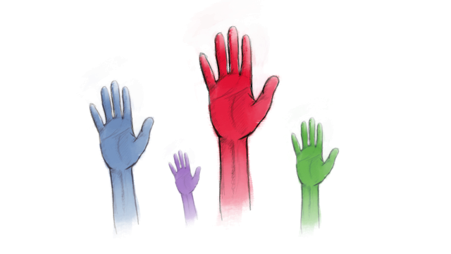

*An article by Nicolas "Duduf" Dufresne, lead developer of* Duik *.*

# Be annoying, be angry, be upset.

> Always create for the benefit of the people the instruments of their well-being, and you will have created the instruments of their power and emancipation.
> <figcaption>Jean-Baptiste André Godin</figcaption>

When I started to develop my own software to help my own work in animation, it was just my own tools and nothing else. It was private and made my life better, it had no impact at all on other people’s life. Well, to be honest, as I wasn't working alone, it quickly had a small impact on my colleagues, easing their processes too.

And then, I decided I could share those tools with the rest of the world, if the rest of the world was interested. And it was. The most well known of my tools, Duik, is now downloaded 1000 times a day. Going from private to public made these tools political. I had to choose how they were going to impact other people’s life.

## Everything is about choices

What was I going to do? I had a new product, I could just sell it like almost everything else in our capitalist society, or even better, I could rent it to keep my customers as hostages. But I had a unique occasion to **think** about my own impact on the world. There are a lot of things I don’t like in our society: individualism, consumerism, competition… Everything is connected, intertwined. Because our society is capitalist, it makes people individualist competitors and consumers. It’s how things go. The question is: what will happen if we get really conscious of this? What will happen if we follow other paths?

I chose to do things in a less common way, maybe even a rare way: I chose to give away my tools. I chose not to earn money with them, or at least, **I chose to let people choose if it was worth paying for**. I chose freedom, for myself, and for the rest of the world. I chose to let my tools open source, I chose to let people get, use, and modify them freely, instead of being worried of stealers and pirates. I chose to make my stuff available even for the poorest human being on earth. Because I think my choices can have an impact. Because I think that if I work outside of and against capitalism and consumerism, **if I show a different path, the path may be followed**, and maybe, maybe it’s a step to what I think is a better world. Politics, that’s just politics.

One is ready to accept a lot of compromises[^1] to be able to consume the easy way. But if one's been given the choice either to consume freely, or to donate time or money, one just consumes and nothing else. It's too easy to just download and use if it's "free", so much easier than making a donation first, or to contribute in any way.

It would have been easy to sell my tools. It would have been easy not to give any choice to the users. **But I chose a difficult path**. I know that most people won't understand it, **but I don't regret my choice**, and I would do it again - **even if I know I could be richer than I could ever have imagined** - because it's more important for me to show that another world is possible, where people are **free from property**, where **economy is subordoned to the well-being of all**, where **happiness comes from equality** of all the people. This better world already exists and just need to be extended, that's what I'm trying to show; you just have to join us.

> Consume less, share better.
> <figcaption>Hervé Kempf</figcaption>

## Numbers

Duik is a big success. **Millions of downloads** so far, an average of **1000 downloads per day**, thousands of daily users.

It’s a big success, with very few supporters. 250 backers during each of the crowd-funding campaigns, 300 [monthly or annual subscribers](http://membership.rxlab.info)[^2] and [patrons](https://patreon.com/duduf)[^3] (and those groups are overlapping, we can’t even add the numbers).

It’s a big success, with even fewer contributors. There are less than 10 meaningful contributors (to the code, the translations, the documentation...).

It's a big success, without earning even a single full-time salary in the country where it's developed (France).

We estimate **less than 4% of our daily users** did contribute time or money to the project.

It works, thanks to other ways of earning the missing money (selling tutorials and books for example). But imagine what we could do if more people contributed! If, for each download, we got a single US dollar, we would've got millions to improve the world together!

Despite the fact that Duik is useful to - and needed by - the society, there's no reward and it stays very hard to develop and maintain. Because in our capitalist world, **we don't reward what's useful or needed; products are valued based on an abstract market value**. Products have to be sold to be valued. That's how capitalism and mercantilism work, hand in hand.

> Property is the Right of Increase claimed by the Proprietor over any thing which he has stamped as his own.
> <figcaption>Pierre-Joseph Proudhon</figcaption>

## Consume less and contribute more

I’m not upset, I’m not discouraged. On the contrary, because I did things differently, I thought differently, I achieved something different. Obviously, I don’t do what I do for money – but unfortunately money is a need.

Why so many efforts? Because I chose not to be only a **consumer**, but I wanted to be a **contributor**. I don’t want to consume life, I want to contribute to the society, because I'm the product of society and I have a great debt to it.

> Even the most wretched individual of our present society could not exist and develop without the cumulative social efforts of countless generations. Thus the individual, his freedom and reason, are the products of society, and not vice versa: society is not the product of individuals comprising it; and the higher, the more fully the individual is developed, the greater his freedom — and the more he is the product of society, the more does he receive from society and the greater his debt to it.
> <figcaption>Mikhail Bakunin</figcaption>

I’m not waiting for someone to sell me what I need, I try to build what I need and then **share it, before someone else sells it**. I want to be able to explain what I did to the society, and be proud of it. Selling my software would not have been a contribution to society, even if it's needed and successful, because it would not have pulled our community to what I think would be the right direction. It would only give me the sensation I did something which matters, but it would not have been really useful for the community. It’s not enough to make useful things, what’s important is what we do with them, ***how*** **we make them**, ***how*** **we share them**. This is my point of view, and **it matters**. **It matters that I have a point of view**, it matters that I say it out loud. It matters that **creating free software is a political gesture for me, because this means I’m contributing to the community**, because it means I asked myself enough questions about what I was doing and how it would impact others.

It’s an effort, it’s harder than being a simple consumer, it’s less rewarding in the short term, but way more in the long run, because I can be proud. Not rich, but legitimately proud.

What I want you to know, is that it’s actually not so hard. Join us!

Of course I had the luck of being able to do it, I had the luck to be born where I was born, to have had a little spare time at some point in my life, to have had a good education… But it’s not just luck, it’s also choices. **Political choices**, ethic choices.
Everyone can ask questions, everyone can be angry at things, everyone can think about individualism and consumerism. **Everyone can – and has to – be upset about our society. Everyone can do politics.**

> The fate of the country does not depend on how you vote at the polls — the worst man is as strong as the best at that game; it does not depend on what kind of paper you drop into the ballot-box once a year, but on what kind of man you drop from your chamber into the street every morning.
> <figcaption>Henry David Thoreau</figcaption>

Maybe you’re already trying to change the world in your own way, or maybe you don’t know how to do it. I just hope you’ll think about it now, that’s what I’m asking. **Do things in a way they matter** and think about how they matter. Do what you can, no less, no more. **We’re enough people in the world to make the society change**. 

There are a lot of concrete ways to contribute more and consume less, even without being a specialist.

- Most of all, **think** about what you’re doing and **how you can do it in a way that matters**. Be political.
- **Make choices**. Don’t let the system make your choices before you do. Everything you do deserves that you ask yourself: “How can I do this or that in a better way? Is there an alternative to consuming this product or this service?”.
- **Be uncompromising** if you know what you’re doing will make things better. **Every little detail is important**, there’s so much we’re fighting for, there’s so much we’re losing, we cannot make compromises.
- **Don’t wait for someone to sell you what you need, try and build it whenever you can**. And most of all, share it when it’s done.
- **Don’t do things just for yourself**. There’s surely someone else who has the same needs than you. Ask yourself: how can I share with those people, even if they don’t have money.
- **Learn**. To be able to develop Duik, I had to learn coding. I did not know anything about computer science before I tried to develop my own tools, I did not learn this at school. Each and every little thing you learn is a political gesture too. The more you learn, the more impact you can have.
- **Teach**. Help others learn. It’s easier when you’re not alone, and **I learned much more by teaching than when I was at school**.
- Use your language, maybe **you can translate things** to make them available to more people (maybe you can translate this article?).
- You’re a user, maybe **you can provide some constructive feedback**, not based on what you want and need, but thinking about what the community may need based on your experience.
- **Contribute financially to projects which matter** (which have an impact, which pull the community in the direction you think is right, not only because of *what* they do, but more importantly because of *how* they do it).
- **Be an example**, spread the word, convince people, share this article, exactly like what I am doing right now. Every public thing is political and deserves to be discussed.

**Be annoying, be angry, be upset**.

## Help Duik

- [**Subscribe** to the RxLab. membership](http://membership.rxlab.info)[^2] and benefit from nice perks like an early access to the tools.
- [Make a **donation**](http://donate.rxlab.info)[^4] to help the development according to your means.
- [Contribute](http://contribute.rxlab.info)! Code, translate, report bugs, request features, update the doc, donate... There's a lot to do, check on [contribute.rxlab.info](http://contribute.rxlab.info)

[^1]: Rent, pay, give away all one's personal data, be overwhelmed by ads...; when we don't have the choice, we're accepting all of this without protesting.

[^2]: Visit [membership.rxlab.info](http://membership.rxlab.info) for more details about RxLab. membership.

[^3]: Visit [patreon.com/duduf](http://patreon.com/duduf) to become a patron.

[^4]: Visit [donate.rxlab.info](http://donate.rxlab.info) to make a donation right now.
