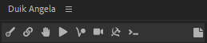
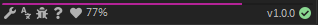
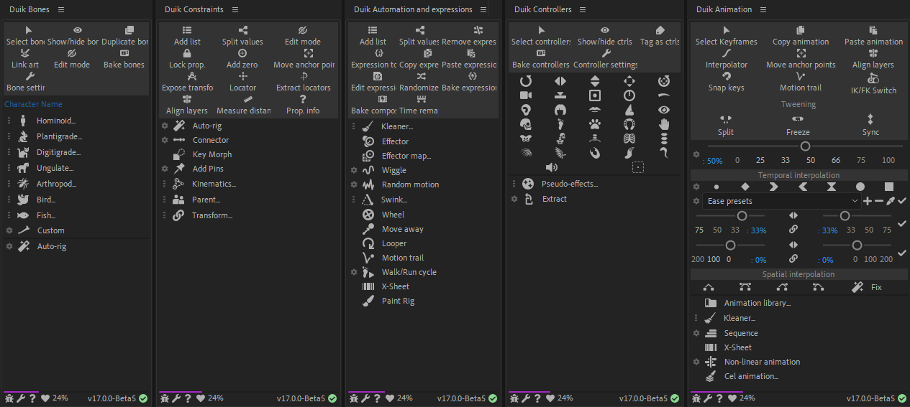
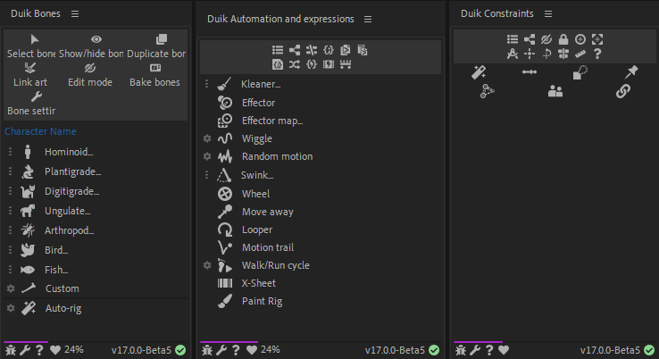
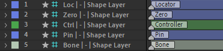
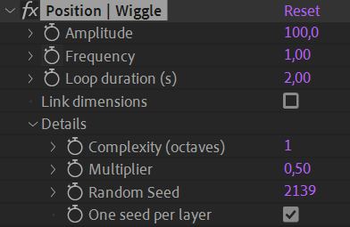

# First Look

## How Duik works

Duik is a script. This means all it does is automating things. It does nothing you could not do manually by yourself in *After Effects* (if you had time to do some very tedious work).

This has two important meanings:  

1. A project rigged or animated with Duik can be opened with any instance of *After Effects* even if Duik is not installed.
2. Duik uses only tools and techniques already existing in *After Effects*.

## Principles, User Interface and User Experience

The goal of a tool like Duik is to make the life of animators and riggers easier. **The priority was to make Duik as easy to learn as possible**, while keeping it **very quick to use**. The other important goal was to make the interface as small as possible, so it won’t take much space in the *After Effects* interface; we think it’s very important to be able to focus on the timeline and the viewport of the application, without any other tools distracting you when you’re animating.

To achieve this, we’ve made Duik smarter. **Almost all tools can be used in a single click**, without any prior configuration steps, **letting Duik make the best choice** depending on what you’re doing, what are the selected layers, etc.

Most of the character rigging process can be reduced to two clicks in *Duik Ángela*!

1. First click: create some *Armatures and bones*.  
2. Second click: *Auto-rig* the whole *Armature*.  
3. If you feel this is not enough, a nice procedural walk and run cycle is just another click away…

### User Interface (UI)

As any modern script in *After Effects*, Duik has the form of a panel which can be docked with other native *After Effects* panels and third party tools (provided it was [correctly installed](install.md) and launched from the *Window* menu of *After Effects*).

The User Interface has been designed with these main ideas in mind:

1. **Keep it close to the form of the user interface of** ***After Effects***
    Using controls similar to the native controls of *After Effects* helps the user get started quickier. But it was not possible, for specific features and for performance and stability reasons, to make everything exactly the same as in *After Effects* and controls differ a bit. The idea is that Duik must not stand out too much when docked with other *After Effects* panels.
2. **Do not use windows and dialogs**
    With very rare exceptions, everything Duik needs to display will be displayed in its main panel, it won't use dialogs and other windows, so you know where to find information, and you're not distracted by pop-ups. Also, there are no blocking windows (what's called *Modal Dialogs*), to keep an agile workflow.
3. **Keep the UI as small as possible**  
    What is important when working with graphics is the viewport. Duik is as small as it can be so it won't interfere with your workspace.

Duik welcomes you with this *home* panel, from where you can quickly access all the features.

The top bar shows the main categories (read below). The central panel is used to display the tools, knobs and buttons of the tools, and the bottom bar includes secondary options and features.

!!! tip
    This home screen can be [de-activated](../guide/settings.md) to get to the latest used panel as soon as Duik is launched, but this greatly increases its launch time.

### Categorization

Duik is a comprehensive tool set for rigging and animation. This means there are a **lot** of tools available, but they are categorized in some useful panels, depending on what you're doing (animating, rigging, using cameras,etc.)

These categories are always available on the top bar.

Each panel can be displayed by clicking on one of these top buttons. 

- {style="width:24px;"} [***Bones***](../guide/bones/index.md)
- {style="width:24px;"} [***Links and constraints***](../guide/constraints/index.md)
- {style="width:24px;"} [***Controllers***](../guide/controllers/index.md)
- {style="width:24px;"} [***Automation & expressions***](../guide/automation/index.md)
- {style="width:24px;"} [***Animation***](../guide/animation/index.md)
- {style="width:24px;"} [***Camera***](../guide/camera/index.md)
- {style="width:24px;"} [***Tools***](../guide/tools/index.md)
- {style="width:24px;"} [***Command Line and Feature Library***](../guide/cmd.md)

The {style="width:16px;"} button on the right hand side opens a simple [note editor](../guide/notes.md).

On the bottom bar, you'll find some other useful buttons:

The progress bar (here in purple) shows how much money we got in donations for the current month. When it's filled (it takes the whole width), we've reached our monthly goal; if it's not, it's time for you to join the [RxLab. Membership](http://membership.rxlab.info)[^membership] or [donate](http://donate.rxlab.info)[^donate]!

The {style="width:16px;"} ***Donate*** button opens the donation page, to help us continue to develop free software. Thanks!

The percent shows the money we got in donations for the current month, like the progress bar just above.

The text on the right hand side shows the current version of Duik. You can click it to get to the official website for Duik.

The icon on the right hand side shows the current result of the [sanity tests](../guide/sanity.md) run by Duik to check everything works smoothly in After Effects.

- {style="width:24px;"} ***Bug report and feature request***: click this button to let us know what's on your mind.
- {style="width:24px;"} [***Settings***](../guide/settings.md)
- {style="width:24px;"} ***Translate Duik***: opens the website where you can [contribute to the translation of Duik](http://translate-duik.rxlab.io)[^tr].
- {style="width:24px;"} ***Help***: opens the online help (this documentation you're reading), kept up-to-date.

### Individual panels

As Duik is made of a lot of panels and sub-panels, depending on your workflow, sometimes you may lose time constantly switching from one panel to another, or just finding a tool you're not used to. As there are as many workflows as users, to address this issue Duik now comes with a lot of optional, individual and [dockable panels](install.md), which you can use as stand-alone scripts. This is a great way to organize your workspace and keep several different panels of Duik opened at once.

When these stand-alone panels are installed, you can also quickly open them by `[Alt] + [Click]` on the tab buttons in the Duik Ángela main panel.

!!! tip
    Don't forget the *stacked* mode for After Effects panels, which can be nice to keep all your Duik panels at hand.

!!! warning
    The more you open different script panels, the more memory leaks from After Effects. This can lead to very poor performance of the user interface of After Effects and of all script panels. Until this issue has been fixed by Adobe, try to limit the number of script panels you open during a working session, and/or restart After Effects regularly[^perf].

### User Experience (UX)

For every feature in Duik, the goal is to have a consistent workflow, the fastest possible, the easiest possible.

Most of the tools work this way:

1. Select layers, properties or keyframes in the timeline of *After Effects*
2. Click.
    1. Click on the button of the tool you need
    2. For some tools, a secondary panel is displayed to ask for some additional needed information
3. Watch Duik work
    (Actually, you won't, as for performance reasons most of the work remains hidden from the user, sorry ;) )

To be able to work in a single click, the tools need to be smart enough to take some decisions depending on what you're doing.  
Of course, Duik does not want you to be or feel limited to what you can do. Although most of the tools work in a single click, some of them are accompanied with a small {style="width:16px;"} button. This means there are options you can change for the future use of the tool, which you can access by clicking on it.

Duik can also be personalized through some [settings](../guide/settings.md) so you can adapt it to your liking.

If you need help about any of the tools, keep your mouse cursor above the corresponding button: very often more details are explained in the tooltip which is shown a couple of seconds later.

As you can read in the tooltip, when options are available for a specific tool, you can also `[Shift] + [Click]` to access them.

### UI Modes

The User Interface can be adapted depending on the level of the user, to make it easier to use for beginners, while quicker and smaller for the most advanced users.

<figcaption>Rookie, Standard and Expert modes shown in different panels.</figcaption>

This UI mode can be changed through the [*settings*](../guide/settings.md).

## What Duik does in *After Effects*

The *After Effects* features mainly used by Duik are:

- Expressions and parenting
- Layer creation
- Custom (Pseudo) effects

### Expressions

Every time Duik adds an expression to a property, the expression begins with a comment to let you know what the expression is and does.

### Layers

Although Duik uses existing layer types in *After Effects* (mostly shape layers and null objects), the layers it creates have a specific use and can be considered as new layer types.  
Layers created by Duik have a marker at their beginning, showing how Duik uses them (their "Duik Type"), and containing important data that Duik needs to work with. **Do not remove these markers** (but you can move them away, even before the beginning of the comp to hide them, if you find them annoying).

These markers can also be used to store and show other useful information, like the location of the limb, or the groups[^dugr] the layer is assigned to.

### Pseudo effects

<figcaption>The pseudo effect used by the <a href="../guide/automation/wiggle.html"><i>Wiggle</i></a> tool.</figcaption>

Duik uses a lot of pseudo effects. *Pseudo-Effects* are a hack to create nicer controls for expressions than the native After Effects *"Expression controls"* effects, but they do nothing more than controlling expressions too. It's a bit complicated to create them by hand in After Effects, but there are useful scripts which do this very easily like *Pseudo Effect Maker*[^aescripts].  
Duik makes a great use of them to create nice user-friendly controls in the effects of the controllers. Always have a look in the *Effects* panel of After Effects when you rig or animate something with Duik!

### Removing Duik "effects"

When you need to remove something made by Duik, you have to understand that Duik did nothing more than creating layers, expressions and pseudo effects.  
Each time you need to remove something, you just have to remove the expressions and pseudo effects created by Duik, and maybe the layers too.  
This can sometimes be a bit tedious, but future versions of Duik will include tools to automate this process.

!!! tip
    If you remove the pseudo effect first, the expressions will be in error. That makes it easier to locate and remove them!

[^membership]: Visit [membership.rxlab.info](http://membership.rxlab.info) to join us!

[^donate]: Visit [donate.rxlab.info](http://donate.rxlab.info) to make a donation.

[^tr]: Visit [translate-duik.rxlab.io](http://translate-duik.rxlab.io) to help translate Duik to any language.

[^perf]: To learn more about the performance of After Effects and Duik, read the section entitled [*Advanced / Performance*](../advanced/performance.md).

[^dugr]: Duik works hand in hand with another tool called ***DuGR***, which groups layers. You can get it on [rxlaboratory.org/tools/dugr](http://rxlaboratory.org/tools/dugr) and read its complete documentation on [dugr.rxlab.guide](http://dugr.rxlab.guide).

[^aescripts]: Available on [aescripts.com](https://aescripts.com).