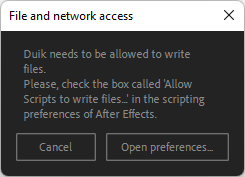

# Install Duik

## Supported versions of After Effects

**Duik is always tested and works with the most recent release and beta versions of After Effects**, on all platforms compatible with After Effects.

Unfortunately, due to Adobe policy about older versions of their software, Duik is **not** compatible with versions of After Effects **older than 18.x (2021)** (≥ 18.0).

## Installation

  
*This video is part of __the official comprehensive video course about Duik Ángela__*

### **1 - Download** Duik from the [official website](https://rainboxprod.coop/en/tools/duik/).

### **2 - Unzip** the files you have downloaded.

You'll find several folders and files.

- *README.txt* contains a lot of information to help you get started with Duik.
- The *Help* folder contains these help pages. Double click on the file *index.html* to open it.
- The *Tools* folder may contain some useful tools.
- The *ScriptUI Panels* folder contains the actual *Duik Bassel* script you need to install.  
  There are many available panels. The main Duik panel, containing the complete tool set is the file called `Duik Angela.jsx`; if you install only this one you'll have all the features in a single panel. Other files are individual panel providing subsets of the Duik tool set, to give you more options to customize your After Effects workspace. You can install as many of them as you need.

### **3 - Install**

You can choose one of these three options to use Duik:

- Manually **copy the files** to the main ScriptUI Panels.
  For this to work, you need to have administrator rights on the computer. Duik will be available to all users.
- **Install from within After Effects**.
  You don't need administrator rights this  way, but Duik will be available only for the current user.
- You can also **use Duik without installation**.
  Duik will not be dockable into the After Effects workspace, it will be a floating panel.

#### Copy the files

- **Copy** the files of your choice from the *ScriptUI Panels* folder to:
    - Windows: `C:/Program Files/Adobe/Adobe After Effects XXXX/Support Files/Scripts/ScriptUI Panels/`  
    - Mac OS: `/Applications/Adobe After Effects XXXX/Scripts/ScriptUI Panels`

You'll need administrator privileges to install Duik this way. If you don't have them, see the other ways below.

- **Restart** After Effects

#### Install from within After Effects

- **Open** After Effects
- Use the `File/Scritps/Install ScriptUI Panel...` **menu** to select and install the panels of your choice from the *ScriptUI Panels* folder.
- **Restart** After Effects

#### Use without installing

You'll always be able to run Duik without even installing it.

- **Open** After Effects
- Use the `File/Scritps/Run script file...` **menu** to select and run the panel of your choice from the *ScriptUI Panels* folder.

### **4 - First Run**

#### File and network access

On first run, Duik may first ask for file and network access, this is mandatory to make it work[^1].

If you see this window, click on *Open preferences*. This opens After Effects scripting preferences.

Check the box called *Allow Scripts to Write Files and Access Network*, then click the *OK* button.

#### Select language

By default, the language is set to [*Esperanto*](https://en.wikipedia.org/wiki/Esperanto)[^2].

Select the language of your choice and click the *Apply* button.

[^1]: Duik needs this option in order to be able to:  
    • Write the images and icons it needs to the disk.  
    • Write the effects it uses to the disk.  
    • Save your notes using the [Duik notes](../guide/notes.md).  
    • Manage the animation library and save the animations.  
    • Save the expressions opened in an external editor.  
    • Access the network to check for updates. Duik only accesses `http://api.rxlab.io` and does not share any personal data.

[^2]: *Esperanto* is the world's most widely spoken constructed international auxiliary language. Created by Warsaw-based ophthalmologist L. L. Zamenhof in 1887, it was intended to be a universal second language for international communication, or "the international language" (la lingvo internacia).  
    Read more on Wikipedia: [en.wikipedia.org/wiki/Esperanto](https://en.wikipedia.org/wiki/Esperanto)