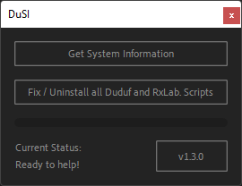

# Troubleshooting

If you run into any problem with Duik, here are a few tips to help you fix your issues by yourself.

## 1 - Check in the frequently asked questions if there's an answer to your problem.

► [**Read the FAQ here**](../faq.md).

If you **don't find the answer in the FAQ**, and your problem is an **error/crash/bug, follow the next steps**.

**If there's no error** of any kind, no crash, no bug, read this documentation to make sure you're using Duik right, then **come and [have a chat with us](http://chat.rxlab.info)**[^1] so we can help you.

## 2 - Use DuSI to get system information and clean/re-install Duik.

We provide a script called [*DuSI*](https://rxlaboratory.org/tools/dusi/) which cleans all tools developed by RxLaboratory for After Effects, and can gather useful system information in case you need more support.

You'll find the script in the *Zip* archive you've downloaded to install Duik, in the `tools` subfolder. You can also [download it here](https://rxlaboratory.org/tools/dusi/).

There's no need to install it, you can just run the script through the `File/Scripts/Run script file...` menu entry in After Effects.

This panel is shown:

1. Click on the *Get System Information* button and save the file. Keep this file at hand as you may need it later if you need more support.
2. Click the *Fix / Uninstall* button.

Most of the times, this simple process fixes all RxLab. tools you may be using in After Effects. Simply start Duik again and check if it works.

If Duik still does not work correctly, follow the next steps.

## 3 - Run Duik in debug mode

1. [Go to the settings](../guide/settings.md) of *Duik* to enable the *Dev and Debug mode*
2. Restart *Duik*
3. Try to reproduce your problem, and copy or take a screenshot of any error shown by *After Effects* or *Duik*.
4. Copy the debug log you should find in the *Duik* subfolder of your default documents folder to a safe place and attach it to any request or bug report later.

## 4 - File a bug report

1. Go to [the **issues** report form on *rxlaboratory.org/issues*](https://rxlaboratory.org/issues). You can use the {style="width:20px;"} button at the bottom of the Duik panel to quickly open this page.
2. Fill in **all the details** you can: what exactly is the issue, what were you doing when it happened, what error is shown, screenshots or video recordings of the issue...
3. **Add the System Information** report you got at step *2*.  
**This is mandatory**. You can copy and paste the content in the form.
4. **Add the debug log** you got at step *3*.  
**This is mandatory**. You can copy and paste the content in the form.
6. **Be patient**. We'll review your report as soon as possible.

## 5 - Contact us

Feel free to [come and have a chat](http://chat.rxlab.info)[^1] with us, so we can easily talk about the issue. This is the only place where you'll get a response for your issues, we do not provide support on any other platform.

[^1]: Here's the link to use to contact us: [chat.rxlab.info](http://chat.rxlab.info)