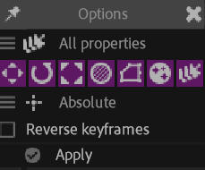
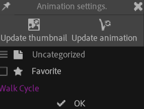

# {style="width:1em;"} Animation library

The animation library is a quick and easy way to store, manage and share reusable animations.

It's both a panel in Duik, and a folder on your disk, so that it can easily be synchronized[^sync] and shared.

## Panel

You can use the field on the top of the panel to quickly search for animations and navigate in the caterogies.

1. **Select the layers** receiving the animation.
2. **Select an animation** in the list.
3. Click the {style="width:1em;"} ***apply*** button to apply the animation on the current layers at the current time.  
You can `[Shift] + [Click]` the button to access additional options.

You can click the {style="width:1em;"} folder icon to open the folder where the library is stored, or `[Alt] + [Click]` it to tell Duik to use another folder. If a library is already available in the new folder, it will be automatically loaded; this is an easy way to keep multiple libraries on the same system.  
By default, the library is in the `Duik` subfolder of your documents folder, which is where settings, notes, and translations are also stored by default.

With the next buttons, you can change how the items are sorted in the panel, and refresh the library if you've manually added new files or if something is missing in the list.

!!! note
    For now (2023) the animations are applied *as is*, which makes it necessary to manually adjust the position and other spatial values when transfering an animation from a character to another with different proportions. Other properties should work fine though.

    This is going to change though as we're working on a way to automagically adapt animations to the character receiving it, by also storing the proportions from the original character to be able to apply a ratio before applying them to the new character (or prop).

### Options

You have the option to apply all available values to all properties, or only apply the animated ones (the ones with keyframes).

You can also choose which type of properties to use or ignore, by checking the icons:

- {style="width:1em;"} Position of the layers
- {style="width:1em;"} Rotation of the layers
- {style="width:1em;"} Scale of the layers
- {style="width:1em;"} Opacity of the layers
- {style="width:1em;"} Masks
- {style="width:1em;"} Effects
- {style="width:1em;"} All properties

The new values can either replace (***absolute***) or be added (***offset***) to the current values, and you can optionally **reverse** the keyframes in time.

### Editing the library

#### {style="width:1em;"} Add

Click the {style="width:1em;"} *add* button to add a new category, or a new animation from the currently selected layers, in the current library category.

When adding a new animation, you have the option to automatically bake all expressions to keyframes. For more options on the baking process, you could instead use the [Bake Expressions](../automation/tools/bake.md)&nbsp;[^bake] tool beforehand.

[^bake]: *cf. [Automation and Expressions](../automation/index.md) / Tools / [Bake Expressions](../automation/tools/bake.md)*.

Duik renders the current frame of the composition to use it as a thumbnail.

#### {style="width:1em;"} Edit

Select a category and click the {style="width:1em;"} *edit* button to edit its name.

Select an animation and click the {style="width:1em;"} *edit* button to change its thumbnail, its name, replace it by another animation or add it to your favorites.

!!! note
    When updating the thumbnail, Duik will use the current frame of the active composition, which can be any composition and not necessarilly the one containing the original animation.

#### {style="width:1em;"} Remove

Select a category or an animation and click the {style="width:1em;"} *remove* button to remove it.

## Folder

The animation library containing folder has the same hierarchy as the categories in the panel. Changing the files and their location in this folder will actually also change them in the library panel.

Some metadata, like the favorites and history, is stored in the `Duik_animation_library.json` file at the root of the main folder.

!!! note
    For now (2023), animations are stored using a `duio` format which is specific to Duik and [DuIO](https://rxlaboratory.org/tools/duio)&nbsp;[^duio], but this is going to change soon when ***OKA***, the ***Open Keyframe Animation*** format RxLaboratory is developing will be available.

[^duio]: *DuIO* is a collection of tools for exporting and importing stuff in After Effects. It is available at [rxlaboratory.org/tools/duio](https://rxlaboratory.org/tools/duio)

Thumbnails are stored as `.png` files named after the animation `.duio` file.

