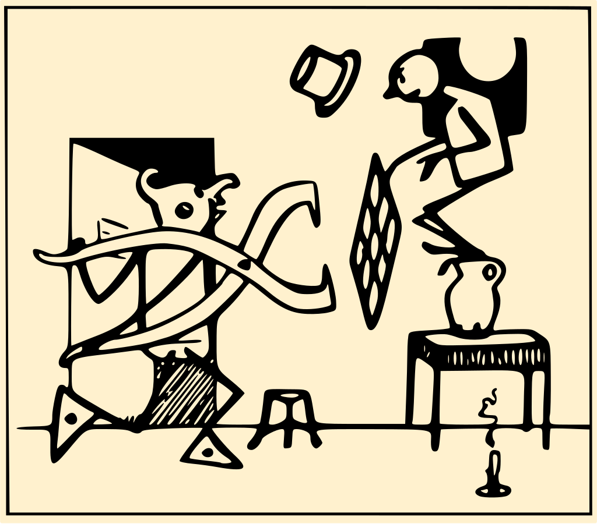
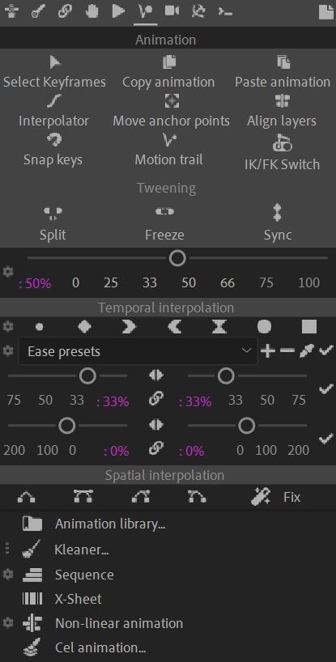

# {style="width:1em;"} Animation

  
*Un drame,  
Émile Cohl, 1908   
Public domain.*{style="font-size:0.8em;"}

Once you've rigged your characters and props, setup useful procedural animation and automation, comes the time to actually animate everything and work with keyframes.  
After Effects is a bit limited when it comes to manipulating keyframes, interpolations and animations, especially if compared with 3D apps. Duik fills the gap with many animation and interpolation[*](../../misc/glossary.md) tools.

## The Animation panel

The tools in the top tool bar are quick tools you may need when animating.

The main tools on the second part of the panel are all the animation tools available in Duik, to keep at hand while you're struggling with keyframes.

## Content

- [Tweening](tweening.md)
- [Temporal interpolation](interpolation.md)
- [Spatial interpolation](spatial-interpolation.md)
- [Animation Library](anim-library.md)
- [Kleaner](kleaner.md)
- [Sequence](sequence.md)
- [X-Sheet](x-sheet.md)
- [Non-Linear Animation](nla.md)
- [Cel Animation](cel.md)
- Tools  
    - [Select Keyframes](tools/select.md)
    - [Copy / Cut / Paste animation](tools/copy.md)
    - [Interpolator](tools/interpolator.md)
    - [Move Anchor Points](tools/anchor.md)
    - [Align Layers](tools/align.md)
    - [Snap Keyframes](tools/snap.md)
    - [Motion Trail](tools/motion-trail.md)
    - [IK / FK Switch](tools/ik-fk-switch.md)

