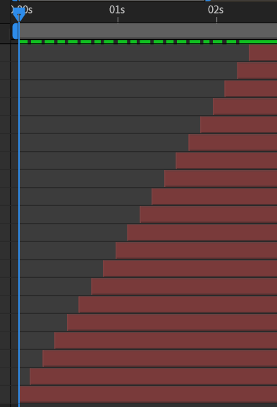
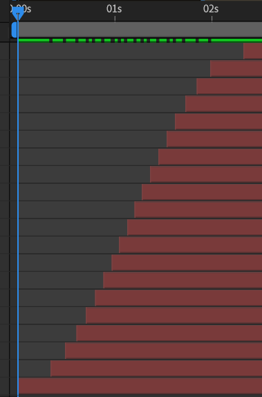
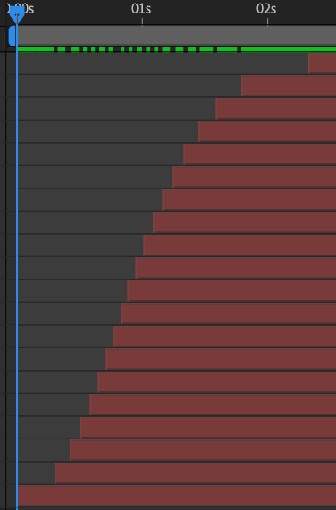
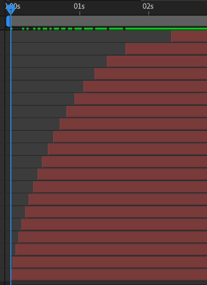

# {style="width:1em;"} Sequence

The *Sequence* tool distributes layers or keyframes in time.

1. **Select** some layers or keyframes
2. Click the {style="width:1em;"} ***Sequence*** button.  
    `[Shift] + [Click]` the button to access some options

You can sequence either the selected **layers** or the selected **keyframes**.

When sequencing the layers, you can choose to either **move** them (***Times***) or **cut** them (***In points*** or ***Out points***).

There are several interpolation[*](../../misc/glossary.md) algorithms available, which define the shape of the sequenced layers or keyframes.

- **Linear**

- **Ease** - Sigmoid (logistic)

- **Natural** - Bell (gaussian)

- **Ease In** (logarithmic)

- **Ease Out** (exponential)

For all but the *linear* interpolations, you can adjust the shape with the ***rate*** slider.

Of course, you can also set the duration of the sequence, in frames.