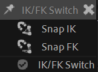

# {style="width:1em;"} IK / FK Switch

The *IK/FK Switch* is an easy way to switch between IK and FK during the animation, if the layers have been rigged by Duik.

1. **Select** the controller of an IK made with Duik
2. Click the {style="width:1em;"} ***IK / FK Switch*** button.  
    Duik will detect if it need to be switched to IK or FK and set needed keyframes at the current time to make the switch.

The switch happens in two steps:

1. Duik snaps the FK to the IK or the opposite, depending on the switch, and adds keyframes to keep the value at the current frame.
2. Duik actually switches between the IK and the FK, adding keyframes at the current time.

You can `[Shift] + [Click]` the {style="width:1em;"} IK / FK Switch button to access the snapping tools.

There you can manually snap the FK values on the IK or the opposite, without actually switching between IK and FK, if you should need it.

