# {style="width:1em;"} Interpolator

The *Interpolate* help you interpolate[*](../../../misc/glossary.md) (and extrapolate[*](../../../misc/glossary.md)) your keyframe values with handy methods other than the usual Bézier and linear functions, or `loopIn()` and `loopOut()` expressions.

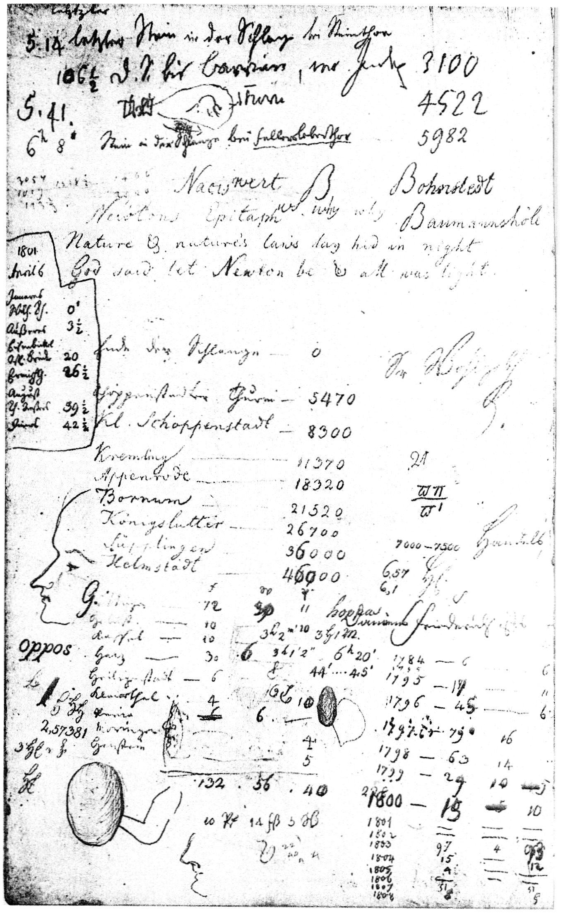  
*Notepad with a drawing of an unknown woman, perhaps Johann Gauss born Osthoff,   
Carl Friedrich Gauß, 1804   
Public domain.*{style="font-size:0.8em;"}

In After Effects, like in almost all animation software, interpolation between keyframes is either linear or using a Bézier function. Although using a Bézier function to interpolate keyframes is very powerful, it can take a lot of time to precisely adjust, as between two keyframes there are four parameters to set (two coordinates per Bézier control point, a.k.a. tangent).

Duik can help you with the process, either by controlling the Bézier interpolation with less parameters and some automation, or by introducing completely different interpolation functions[*](../../../misc/glossary.md).

1. **Select** some properties
2. Click the {style="width:1em;"} ***Interpolator*** button.

Duik adds an effect on the layer to let you easily control the interpolation on the properties.

!!! tip
    When you've applied the Interpolator on some properties and then want to use the same Interpolator on other properties, you can just copy and paste the expression in the new properties.

## Effect

You first have to choose the **interpolation type** to use on the property.

Duik proposes these types (read the details below):

- **None** (use keyframes)
- **Linear**
- **Bézier**
- **Gaussian**
- **Logistic (sigmoid)**
- **Logarithmic**
- **Exponential**

Except *None* and *Linear*, all these functions can be quickly adjusted with the ***Rate*** value.

!!! tip
    Both the interpolation type and the rate properties can be animated; this way you can easily use multiple interpolation methods on the same property at different times!

The Interpolator can also be used to extrapolate the keyframes, i.e. to continue the animation after the last keyframe (e.g. loop or follow through), or before the first one. It is even able to detect some fixed parts in the animation in between the keyframes to extrapolate some movement in these parts.

## Interpolation

### None (use keyframes)

With this mode, Duik will not interpolate between the keyframes but let After Effects do the interpolation as you wish, using standard After Effects Bézier or linear methods. This is useful if you'd like to use the Interpolator only for its extrapolation (loop and follow through) capabilities.

### Linear

This is a very simple linear interpolation, similar to the default After Effects keyframes.

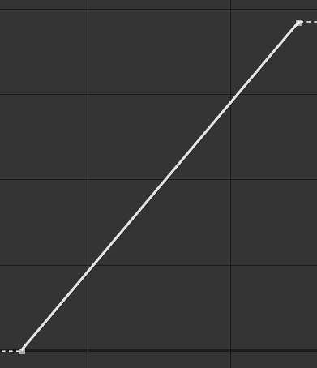  
Linear *interpolation.*

### Bézier

With this mode, you can use a standard Bézier function to interpolate, but control the parameters more easily.

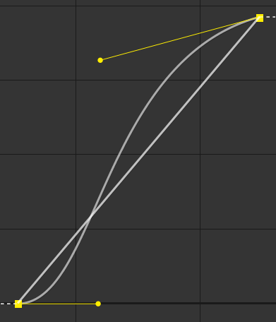  
Bézier *interpolation.*

Duik uses carefully chosen default values for the actual Bézier parameters, and lets you quickly adjust the *easing* using only the *Rate* property of the Interpolator effect.

But you can also manually adjust everything in the *Bézier options* section of the effect.

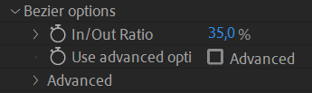

To make it quick and easy to control both Bézier control points (tangents) at once, you can use the ***IN/Out ratio***. With this value, both tangents are horizontal (the After Effects easing *speed* in `0`), and you control the ratio between the length of the two tangents (the After Effects easing *influence*).  
At `50 %`, both tangents have the same length, at `0 %` the *out influence* is `0 %` and at `100 %` it's the opposite.  
With this ratio set, you can then control the actual length of both tangents at once with the *Rate* property of the Interpolator effect, which makes it quick and easy to adjust the Bézier interpolation of all the keyframes at once. Don't forget all these values can be animated!

If you need to set the equivalent of the After Effects easing *speed* (i.e. the angle of the tangents) or control manually and precisely all the values, check the ***Use Advanced options*** box and set the values in the ***Advanced*** section.

### Gaussian

Using a *gaussian* function to interpolate the keyframes helps creating very natural and smooth movements with a single parameter, set with the *Rate* property of the Interpolator effect.

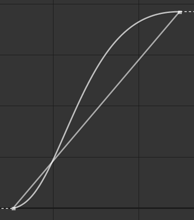  
Gaussian *interpolation.*

This function is also called a *bell* function because of the shape it generates. The resulting motion feels very natural, especially for characters, animals, to show their *will*: although the movement is very smooth, the acceleration is a bit faster than the deceleration, which perfectly mimics the actual acceleration and decelaration of *voluntary* movements.

This acceleration and deceleration can easily be adjusted with the *Rate* property.

!!! note
    The interpolation generated by this gaussian function can't actually be generated by a standard Bézier function (without adding intermediary keyframes); the deceleration can be much smoother, and the motion feels much more dynamic.

### Logistic (Sigmoid)

To the contrary of the gaussian function, the interpolation using the logistic function is perfectly symetrical, with the same acceleration and deceleration (thus its other name, *Sigmoid*).

This may be useful for more mechanical movements.

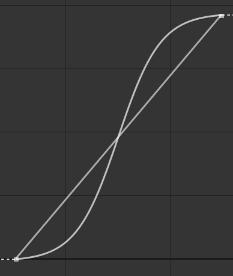  
Logistic *interpolation.*

To the contrary of the Duik Bézier interpolation, with the logistic function, what's controlled with the *Rate* property is the actual speed of the movement. That means the interpolation may not *complete* if there's not enough time between the keyframes or if the rate is too small (when the speed is not high enough to finish and stop the movement given the time between the keyframes).

!!! note
    The movement never actually stop using this function, but given enough time to slow down it's slow enough to seem to stop.

The fact that the speed may not be `0` on the keyframe may actually be very useful when using extrapolations, especially the *continue* or *follow through* modes.

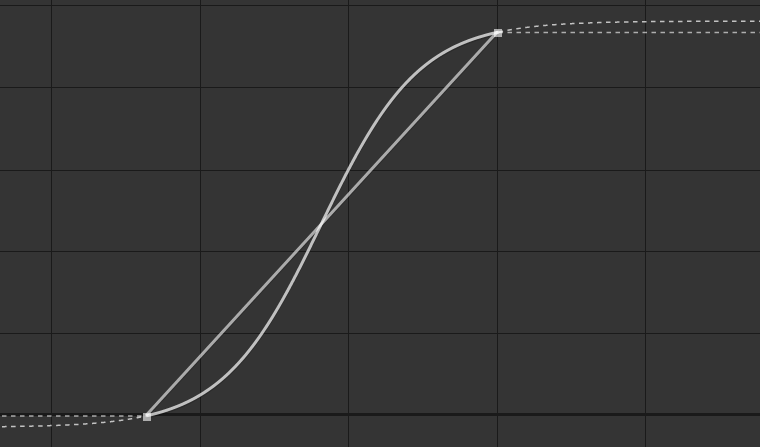  
Logistic *interpolation with the extrapolation set on* continue.

In the example above, the interpolation is set to *Logistic (sigmoid)* and both the *In* and *Out* extrapolations are set to *Continue*. This creates **a movement which never stops**. That would be very difficult to set with a standard Bézier function.

This interpolation works nice with the *follow through* extrapolation too.

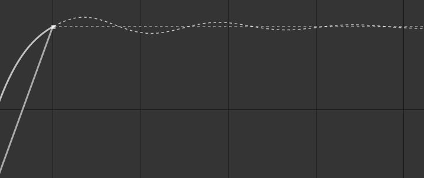  
Logistic *interpolation with the extrapolation set on* follow through.

### Logarithmic or Exponential

Logarithmic and Exponential are always decelerating and always accelerating functions respectively.

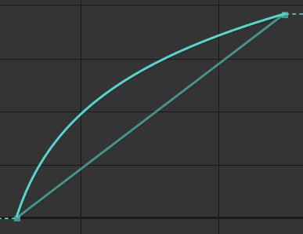  
Logarithmic *interpolation.*

  
Exponential *interpolation.*

They're very useful to animate apparitions or disparitions, objects comning in or getting out of the frame.

Similarly to the *logistic (sigmoid)* function, what makes them interesting is that the generated movement never really stops, and this is especially difficult to setup precisely using standard Bézier functions.  
The generated motion is also very smooth.

  
Logarithmic *interpolation, with the extrapolation set on* continue.

You can use the *Rate* property to adjust the acceleration or deceleration rate.

## Extrapolation

The Interpolator can also extrapolate the movement, continue it after the keyframes, or before them.

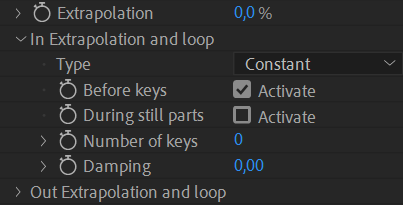

First, the the *Extrapolation* to property to `100 %` (or any value other than `0 %`) to enable it.

!!! tip
    The *Extrapolation* property can be animated to enable, disable or adjust the extrapolation at any time.

The *In* extrapolation section contains the options for the extrapolation before the keyframes, the *Out* extrapolation section for the extrapolation after the keyframes.

There are several types of extrapolation:

- **Constant**: values are not extrapolated, the value of the last keyframe is used.
- **Continue**: the motion continues smoothly after the last keyframe, depending on the interpolation set before the keyframe.  
      
    Continue *extrapolation after a* linear *interpolation.*  
      
    Continue *extrapolation before and after a* logistic *interpolation.*
- **Offset**: the motion is repeaded, the values being added to the last known value.  
      
    Offset *extrapolation.*
- **Cycle**: the motion is repeated.  
      
    Cycle *extrapolation*.
- **Pingpong**: the motion is repeated, reversed every other cycle.  
    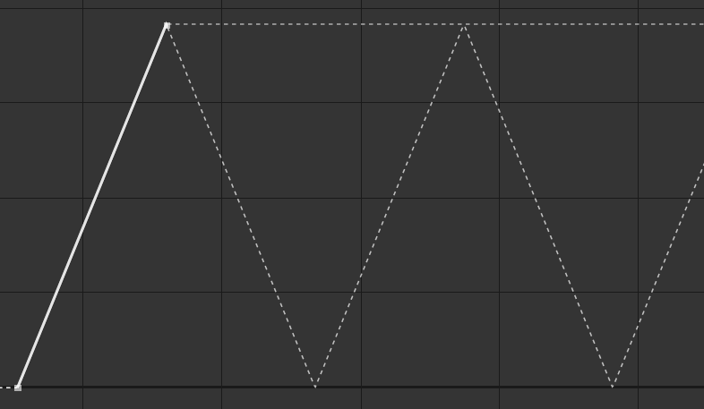  
    Pingpong *extrapolation*.
- **Follow through**: a follow through[*](../../../misc/glossary.md) animation is generated (*Out* extrapolation only).  
      
    Follow through *extrapolation*.
- **Bounce**: a bouncing animation is generated (*Out* extrapolation only).  
    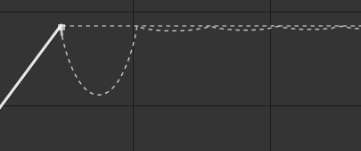  
    Bounce *extrapolation*.

By default, the Interpolator extrapolates **before or after the existing keyframess**. You can also extrapolate **during still parts** of the animation, between keyframes. That's very useful for example to add some follow through animation every time the animation stops, even if there are other keyframes later in the timeline.

You can choose the **number of keyframes** to be used to extrapolate the motion (for the *Offset*, *Cycle*, and *Pingpong* modes only). If this is set to `0`, the Interpolator will use all available keyframes.

The **damping** value controls the time it takes for the motion to come to a full stop (and get back to the last keyframe value). This value is especially useful with the follow through or bounce mode, but can be used to dampen the other modes too, and progressively stop a loop.

With the *Out* extrapolation set to follow through or bounce, you can also control the **elasticity** of the extrapolation, which will change the amplitude and frequency of the extrapolation. You could also use the *Extrapolation* property with values different than `100 %` to control the amplitude.

## Color Options

When interpolating colors, changing the colorspace may help generating better colors between the keyframes.

With After Effects by default, colors are interpolated in an RGB colorspace, and this often generates desaturated colors in between; changing this colorspace may help improve the interpolation by generating more vivid colors in between.

- **RGB**: the default interpolation, where the Red, Green and Blue channels are interpolated separately.
- **HSL**: the color is converted to Hue, Saturation and Luminosity channels before being interpolated and converted back to RGB. This allows for better and more vivid colors in between, but if the colors are too far away from each other in the Hue channel, this may cause the interpolation to go through all the hues of the rainbow.
- **Shortest-path HSL**: this is similar to *HSL* but making sure the Hue channel is always interpolated through the shortest path possible, making sure the number of different hues during the interpolation is as small as possible.
- **Longest-path HSL**: this is similar to *Shortest-path HSL* but taking the longest path with the greatest number of hues as possible.
- **Combined RGB SL**: this mode interpolates the Saturation and Luminosity separately, and uses an RGB interpolation to generate the interpolated Hue, then converts back everything to RGB. The result is slightly different from the *Shortest-path HSL* and depending on the colors to be interpolated may be a bit better or feel more dynamic.

The result depends a lot on the colors to be interpolated and how different they are. The best is to try all the different modes to see which fits better to your needs.
