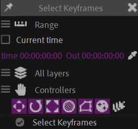

# {style="width:1em;"} Select Keyframes

  
*This video is part of [__the official comprehensive video course about Duik Ángela__](https://rxlaboratory.org/product/the-official-comprehensive-video-course-about-duik-angela/)*

*Select keyframes* is a very useful tool to quickly select a lot of keyframes together in the timeline.

You can `[Shift] + [Click]` the button to access some options.

- You can select keyframes at a specific time or in a time range.

- The time can be the time of the Current Time Indicator or a specific time, and the time range can be either the work area or a specific range.  
    To set specific time and time range, you can click on the eyedropper to pick the current values from the playhead or the work area.

- You can use the filters to select the keyframes of a specific type or on specific layers only.

