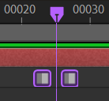
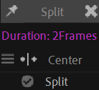
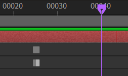
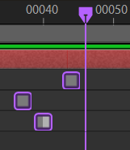
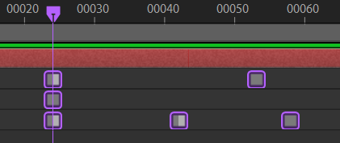
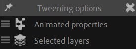

# Tweening

The first part of the animation panel is made of some tweening tools, especially, but not only, useful during the usual first steps of the animation process, blocking[*](../../misc/glossary.md), when animating with *hold* keyframes[^process].

_The_Sinking_of_the_Lusitania_cel_(Lusitania_rolling_over).png)  
*A cel from the animated film The Sinking of the Lusitania,  
Winsor McCay, 1918  
Public domain.*{style="font-size:0.8em;"}

## {style="width:1em;"} Split keyframe

To ensure you'll keep a fixed part in the animation on a specific keyframe, you can *split* it: this tool duplicates the keyframe so there's twice the same keyframe at that time. This makes sure there will be a frozen time around the original keyframe time.

1. **Select** some keyframes.
2. Click the {style="width:1em;"} ***Split*** button.

  
*Original*

  
*Result*

You can tweak the way keyframes are split in the additional panel, with `[Shift] + [Click]` on the {style="width:1em;"} *Split* button.

The **duration** sets the time between the two resulting keyframes, in frames.

You can also set the new keyframes alignment in the timeline, relative to the original keyframe:

  
*The selected keyframe, before it is split*

- ***Center***  
      
- ***After***  
      
- ***Before***  
    

## {style="width:1em;"} Freeze pose

This tool freezes the previous (or next) pose until the current time, by copying the previous (or next) keyframe of the animated properties.

1. **Select** the animated layers.
2. Click the  {style="width:1em;"} ***Freeze*** button.  
    `[Alt] + [Click]` to freeze the next pose instead of the previous one.

  
*Original*

  
*Result*

You can tweak the way the pose is frozen in the additional panel, with `[Shift] + [Click]` on the {style="width:1em;"} *Freeze* button.

By default, Duik freezes all **animated properties** it'll find, but you can set it to only freeze explicitely **selected properties** if you prefer.

By default, Duik works only with **selected layers**, but you can tell it to use **all layers**; in this case it'll freeze all animations in the composition, no matter the selection. Be careful, this may be a bit long if there are a lot of animated properties.

## {style="width:1em;"} Synchronize keyframes

This tool synchronizes all the selected keyframes at the current time.

1. **Select** some keyframes
2. Click the {style="width:1em;"} ***Sync*** button.  
    `[Alt] + [Click]` to sync at the last keyframe instead of the first (in case there are multiple selected keyframes on the same property).

  
*Original*

  
*Result*

If there are multiple keyframes selected on the same property, the animation is offset so that the first (or last) keyframe is synchronized:

  
*Original*

  
*Result*

## Tweening slider

The slider in the tweening section of the panel can be used to quickly and easily create *breakdowns*[*](../../misc/glossary.md) between keyframes.

1. **Select** some properties
2. **Change the slider value** (either with the slider or the value buttons below it)

A new breakdown keyframe (pose) is created at the current time, with values in between the next and previous keyframes at a ratio corresponding to the slider value.  
`0 %` sets the breakdown at the value of the previous keyframe, `100 %` sets the breakdown at the value of the next keyframe.

  
*A `75 %` breakdown: you can see on the trajectory of the eft leg (and other controllers) the breakdown being at 75 % between the two extreme poses.  
This is true for all animated properties like rotations and all other values.*

You can tweak the way the tweening slider works in the additional panel, click the {style="width:1em;"} options button.

By default, Duik freezes all **animated properties** it'll find, but you can set it to only freeze explicitely **selected properties** if you prefer.

By default, Duik works only with **selected layers**, but you can tell it to use **all layers**; in this case it'll freeze all animations in the composition, no matter the selection. Be careful, this may be a bit long if there are a lot of animated properties.

[^process]: In (big) studios, the animation process usually follows these steps:

    1. Layout
    2. Keyframe animation (blocking)
    3. In-betweens
    4. Spline animation

    It's not until the fourth step that the keyframe interpolation is set to Bézier interpolation. During the first part of the process they're kept on hold, and the animation process is very close to a tradional, hand-drawn animation process. This has many advantages: going into lots of details on the shapes and silhouettes, and allows for more checks before detailing the animation. 

    Sometimes, it's quicker to directly animate using Bézier interpolation and curves though.  
    In an nutshell, our advice is:

    - Animate in blocks, with keyframes on hold, where the emotion is more important; this eases the creation of expressive and detailed posing of the character. The shape is more important than the movement in this case.
    - Animate with curves when the movement is more important, for dynamic actions, like waling, fighting, falling, running... In this case, you want to focus on the timing and rythm first, and this is easier with a curve editor.

