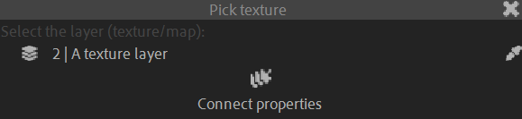

# {style="width:1em;"} Effector Map

The effector map works similarly to the [spatial effector](effector.md)&nbsp;[^effctr] except it uses a texture layer instead of a shape.

  
*This video is part of [__the official comprehensive video course about Duik Ángela__](https://rxlaboratory.org/product/the-official-comprehensive-video-course-about-duik-angela/)*

1. **Animate the slave properties** as they should change with the effector.
2. **Select the texture layer**.
3. Click the {style="width:1em;"} ***Effector Map*** button.  
    
4. **Select the slave properties** to be controlled with the effector map.
5. Click the {style="width:1em;"} ***Connect properties*** button.

You can tweak the effector with the effect on the texture layer.

[^effctr]: *cf. [Automation](index.md) / [Effector](effector.md)*.