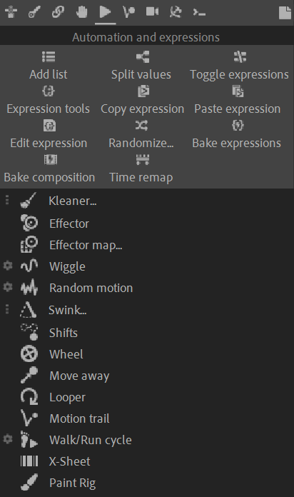

# {style="width:1em;"} Automation and Expressions

Automations, automatic animations, dynamics, physics, procedural animation...

As soon as your character is rigged, you can begin the animation, being helped by a lot of Automations. **Automations** are procedural animations and dynamics to quickly set the most common animations up and then focus on the characterization of your character. You can automate wiggles, springs, wheels, etc. with customizable and advanced controls for example to loop the effects, and access each and every detail quickly and easily.

{style="max-height:720px"}  
*Design on Each Side for Waterwheel Worked by Donkey Power,  
al-Jazari, 1315   
Public domain.*{style="font-size:0.8em;"}

## The Automation and Expressions panel

The tools in the top tool bar help the management of properties and their values and expressions, to help you setup and handle your procedural animations and expressions.

The main tools on the main part of the panel are all the procedural animation tools available in Duik, to help you animate all kind of props and even characters procedurally and automatically.

## Content

- [Kleaner](kleaner.md)
- [Effector](effector.md)
- [Effector Map](effector-map.md)
- [Wiggle](wiggle.md)
- [Random motion](random-motion.md)
- [Swink](swink.md)
- [Wheel](wheel.md)
- [Move away](move-away.md)
- [Looper](looper.md)
- [Motion trail](motion-trail.md)
- [Walk/Run cycle](walk-run.md)
- [X-Sheet](x-sheet.md)
- [Paint rig](paint-rig.md)
- Tools:  
    - [List](tools/list.md)
    - [Split values](tools/split.md)
    - [Toggle expressions](tools/remove-expressions.md)
    - [Expression tools](tools/expressions-tools.md)
    - [Copy / Paste expression](tools/copy.md)
    - [Edit expression](tools/edit.md)
    - [Randomize](tools/randomize.md)
    - [Bake expressions](tools/bake.md)
    - [Bake composition](tools/bake-comp.md)
    - [Time remap](tools/time-remap.md)

