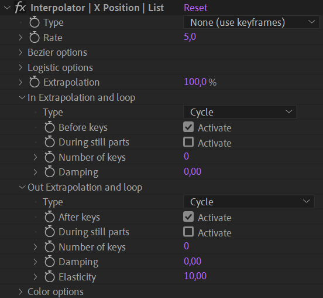

# {style="width:1em;"} Looper

The *Looper* is actually a preset for the [Interpolator](../animation/tools/interpolator.md) available in the Automation panel to replace the *Looper* from the previous version of Duik.

.png)  
*Optical Toy, Phenakistiscope Disc with Cats and Donkey,  
ca 1830   
Public domain.*{style="font-size:0.8em;"}

1. **Select** the properties.
2. Click the {style="width:1em;"} ***Looper*** button

All interpolations are deactivated to keep only the extrapolation, set to a *Cycle* loop for the in and out extrapolation.

▷ Read the *[Animation](../animation/index.md) / Tools / [Interpolator](../animation/tools/interpolator.md)* for more information.

