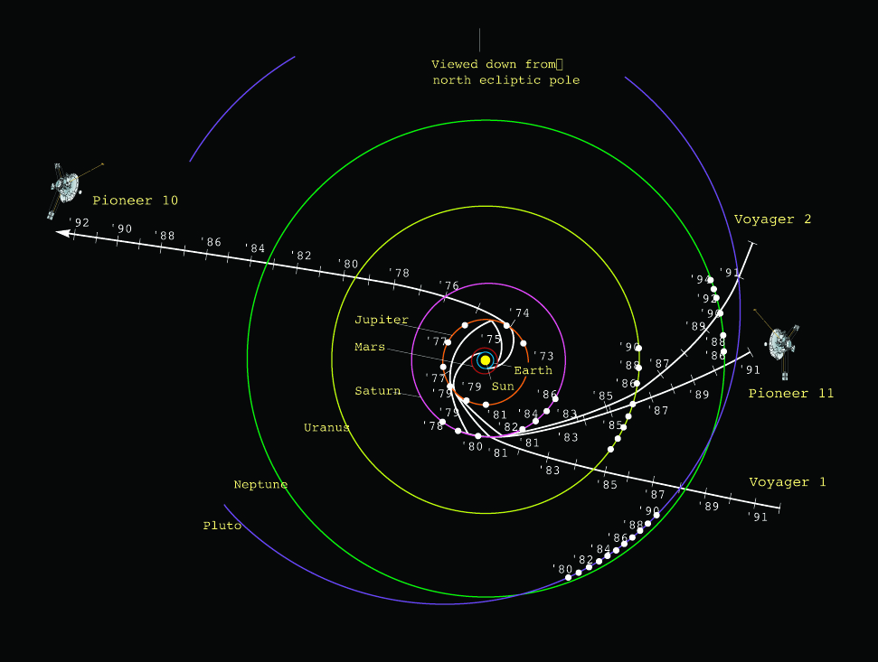
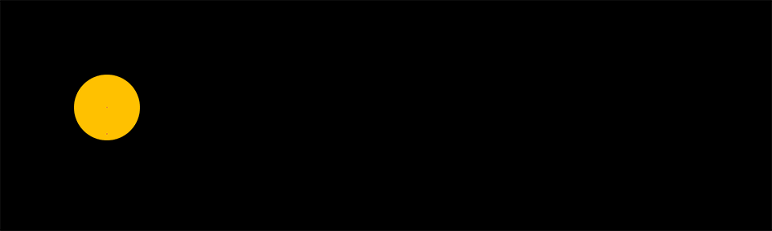
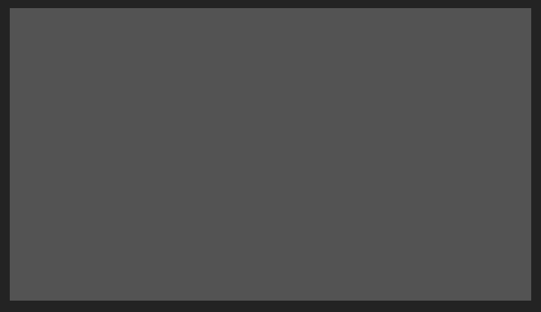

# {style="width:1em;"} Motion Trail

The *Motion Trail* tool draws the trajectory of any layer in a shape layer, and can show trails behind (or in front of) them.

  
* A drawing showing the trajectories of Pioneer 10 and 11 as well as Voyager 1 and 2 on their varied routes out of the Solar System,  
NASA, 25 February 1992   
Public domain.*{style="font-size:0.8em;"}

1. **Select** the layers.
2. Click the {style="width:1em;"} ***Motion Trail*** button  
    - `[Alt] + [Click]` to create a new motion trail layer instead of adding the new motion trail in the existing layer.

!!! Note

    To duplicate a motion trail, you can’t just duplicate the effect; the content of the shape layer needs to be adjusted too.  
    There are two ways to add multiple motion trails for the same layer:

    - Duplicate the motion trail layer instead of just the effect.
    - Use the motion trail button in Duik to re-create a new motion trail for the same layer.

A *Motion Trail* layer is added to the comp. It's a shape layer used to draw the trails. An effect is added on this layer for each motion trail created.

- The ***Motion source*** is the layer used to draw the trail.
- You can set the ***start*** and ***end*** (in frames relative to the current time) to adjust the length of the trail. Note: long trails can make the performance drop (a lot).

▷ Read the *[Automation](index.md) / [Move Away](move-away.md)* section for a nice example of using this Motion Trail in combination with the *Move Away* and *[Swink](swink.md)* tool.

## Basic Parameters

In the *basic* section, you can change and animate basic appearance settings. Keep in mind that Motion trails are standard shape layers and you can do much more with them by modifying the content by yourself.

The *Taper* settings are the same than those you can find in paths in the content of an After Effects shape layer.

## Advanced Parameters

Using the ***`simple (stroke)` Mode***, the trail is a simple open Bézier path with a stroke. Switching to the ***`advanced (fill)` Mode*** replaces the trail by a closed Bézier path filled with a color. This advanced mode allows for taking the 3D depth and scale of the layer into account when computing the width of the trail, so it looks like a 3D stroke (but still in a 2D shape layer).

Depending on how you wish to customize the trail in the contents of the shape layer, sometimes you may also prefer a closed and filled shape than a simple stroke. Be careful though as the performance is reduced using the advanced mode as it needs a bit more computation.

  
*Using the advanced mode, the trail can look 3D*{style="font-size:0.8em;"}

!!! tip
    As the motion trail is contained in a shape layer, it's easy to change it’s appearance and use it as you wish! You can add and modify everything in the content of the Motion Trail layer.

### Sampling and performance

The sampling controls how the motion of the layer is analyzed. With a low sampling, you may see angles appear in the trajectory of fast layers; a higher sampling generates a smoother curve for fast movements, at the cost of performance.

By default, the automatic sampling tries to adjust the number of samples depending on the velocity and choose the best sampling for a smooth curve while trying to keep better performance.  
Sub-frame sampling is a calculation-intensive way to sample the motion where the whole motion is sampled at regular intervals, no matter the speed.  
For both modes, you can adjust the number of samples, which directly controls the quality of the trail but can have a big hit on performance, too.

!!! warning
    This is a sensitive value, use with care!

