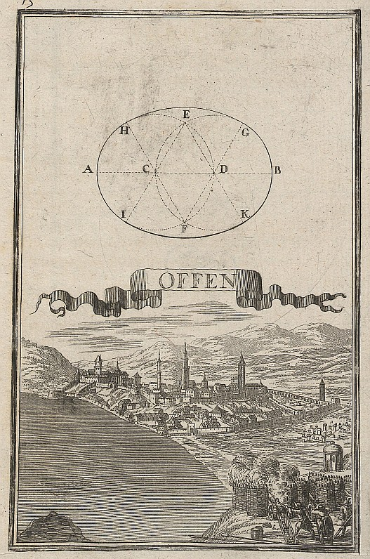

# {style="width:1em;"} Move Away

The *Move Away* tool will add a simple cursor which controls the distance between the layer and its parent.

  
*Konstruktion einer Ellipse, Ansicht der ungarischen Stadt und Festung Ofen,  
Anton Ernst Burkhard von Birckenstein, 1698   
Public domain.*{style="font-size:0.8em;"}

1. **Select** the layers.
2. Click the {style="width:1em;"} ***Move Away*** button

This is very useful when you need to animate the distance separating to layers which are not aligned, or worse, rotating. It's especially fun to use when the parent layer rotates and the child layer revolves around it, see the exercise below.

## Exercise!

Here's an easy but fun exercise to test this tool with other Duik automations.

1. **Create a sun** in the center of the composition. It can be any layer, but it's better if it's not circular so you can see it rotating later.
2. **Create a planet**, asteroid, satellite, anything, revolving around the sun.
3. **Parent the planet** layer to the sun layer.
4. Select the planet layer and click the {style="width:1em;"} ***Move Away*** button.
5. **Animate the rotation of the sun**. Let's just use this expression in the rotation of the layer: `time * 100;`. You can change the `100` to any value to change the speed, or replace by a link to a slider control.
6. Play with the *Move Away* slider on the planet layer, add a few keyframes to see what it does. Loop the animation (with Duik or an expression)!
7. Select the planet layer, add a [***Motion Trail***](motion-trail.md)&nbsp;[^trail], and tweak the settings.
8. For even more fun, remove the animation in the Move Away slider, and add a [***Swink***](swink.md)&nbsp;[^swink]!

  
*Table of Conics,  
Cyclopaedia, volume 1, 1728   
Public domain.*{style="font-size:0.8em;"}

[^trail]: *cf. [Automation](index.md) / [Motion Trail](motion-trail.md)*.

[^swink]: *cf. [Automation](index.md) / [Swink](motion-trail.md)*.

