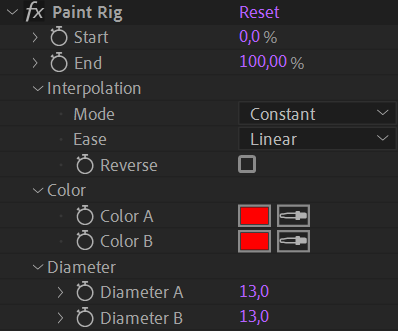

# {style="width:1em;"} Paint rig

Use the *Paint Rig* to rig brush strokes in the paint effect and adjust and animate them as if they were a single stroke.

  
*Die Jungfrau,  
Gustav Klimt, 1913  
Public domain.*{style="font-size:0.8em;"}

1. **Select** some paint strokes
2. Click on the {style="width:1em;"} ***Paint rig*** button

## Effect

Use the effect added on the latyer to adjust and animate all brush strokes at once.

The ***Start***, ***End***, ***Color*** and ***Diameter*** paramaters work like the same parameters in the individual strokes, but controlling all of them as if they were a single stroke.

***Diameter*** and ***Color*** are divided into two parameters to be able to interpolate from the first stroke to the last one, and act like a ramp through all the strokes.  
You can change how this ramp works in the ***Interpolation*** section.

The order of the strokes can be changed at any time by reordering them in the layer stack.
