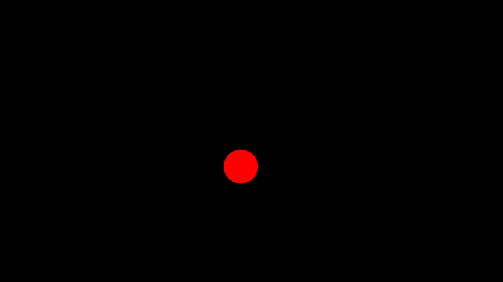
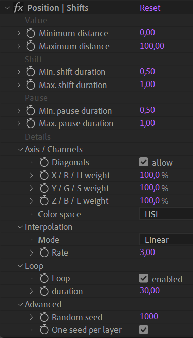

# {style="width:1em;"} Shifts

The *Shifts* tool regularly or quasi-regularly shifts the value of the properties it is applied to.

  
*Space-filling curve,  
David Hilbert, 1891   
Public domain.*{style="font-size:0.8em;"}

1. **Select** the properties
2. Click the {style="width:1em;"} ***Shifts*** button

!!! Tip
    When you’ve applied the Shifts on some properties and then want to use the same Shifts on other properties, you can just copy and paste the expression in the new properties.

The *Shifts* tool is able to generate a path which regularly gets back to its original value, thus it can be used in a loop.

## Effect

The Shifts can be adjusted in the effects of the first selected layer.

Each shift offsets the value by a random amount between the **minimum and maximum distance**. If both are the same, each shift will be exactly the same.  
The duration is of each shift is set with the same principle, between a **minimum and maximum duration** given in seconds. The same is true for the duration of the pauses between the shifts.

For multi-dimensional properties (position, scale, colors...) you can tweak how each axis is offset during each shift:

- You can disallow **diagonals**; in this case, only a single  axis (or channel) can move at once, e.g. effectively constraining the movements horizontally or vertically for spatial properties.
- You can also **weigh**[*](../../misc/glossary.md) each axis individually.
- For colors, you can choose between **RGB** or **HSL** to interpolate the movement and weigh channels accordingly.

You can also adjust the ***interpolation***[*](../../misc/glossary.md) of each shift:

- *Hold (square)* disables interpolation. The property jumps to the next value.
- *Linear* will result in a very simple interpoation without easing.
- *Smooth (sigmoid)* is the smoothest interpolation, similar to a sine function but with the ability to change the *easing* with the *Rate* value.  
    This interpolation is symetrical, like a sine function.
- *Natural (gaussian)* interpolates the value using the gaussian (*bell*) function, which results in an asymetrical acceleration and deceleration. With this interpolation, the motion is more dynamic, and the object looks alive.
- *Slow down (logarithmic)* makes the motion start as fast as possible and quickly slow down when getting to the next value.
- *Speed up (exponential)*  does the opposite of *Slow down*, making the motion start very slowly and speeding up as much as possible.

With the *Smooth*, *Natural*, *Slow down* and *Speed up* interpolations, you can use the ***Rate*** value to adjust the easing (acceleration and deceleration rate) of the motion.

If the ***Loop*** is enabled, all properties regularly get back to their initial value, according to the loop ***duration***; but each new loop is different than the others! The path taken when shifting the values is randomly chosen and there's no actual cycle.

The ***random seed*** is used to generate the pseudo-randomness of the distances and durations.  
By default, all properties using the same *Shifts* effect and on the same layer are synchronized and use the same random seed, but properties on different layers aren't. If you'd like the seed to be the same for all layers, uncheck the ***One seed per layer*** option.  
If you'd like all the properties to not be synchronized, create multiple Shifts effects instead of a single one for all properties.  
To change the randomness, you can change this seed value.

!!! note
    The default loop duration is set to the composition duration.

!!! tip
    If you need an actual cycle, where the path is always the same, you could generate a single precomposed cycle, and use time remapping[^timeremap] to loop this precomposition.

[^timeremap]:
    There is a tool to activate time remapping and loop in a single click in Duik. *cf. [Automation](index.md) / Tools / [Time remap](tools/time-remap.md)*.
