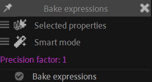

# {style="width:1em;"} Bake Expressions

You can easily *Bake*[*](../../../misc/glossary.md) the expressions to replace them by keyframes and improve the performance.

1. **Select the properties** with the expressions.
2. Click the {style="width:1em;"} ***Bake Expressions*** button.

You can `[Shift] + [Click]` the {style="width:1em;"} *Bake Expressions* button to adjust the options.

- The {style="width:1em;"} ***Smart Mode*** creates less keyframes and uses Bézier interpolation to generate an animation as close as possible of the original animation as computed by the expression.  
    The resulting animation may be a bit different compared to the expression, but its much easier to edit and customize later. It's also much lighter once exported to HTML/JS/CSS animation, like Lottie/Bodymovin for example.
- The {style="width:1em;"} ***Precise Mode*** (a.k.a. *dumb mode*) creates much more keyframes, up to one per frame, but generates the exact same animation as the original one as computed by the expression.

!!! note
    After Effects can natively bake expressions, with the `Animation / Keyframe Assistant / Conver expression to keyframes` tool, but it always adds one keyframe per frame.

    Even with the *Precise Mode*, Duik is a bit smarter than that, as it only adds *necessary* keyframes (it adds keyframes if and only if there's an actual movement). Duik can also optionaly create more keyframes than that, which may be needed for a cleaner motion blur, or less, if it's fine for you to use interpolations in between.

With both modes, you can adjust the ***Precision*** value to change the number of resulting keyframes.  
A higher value will create more keyframes (adding keyframes in between actual frames with the *Precise* mode, useful for a cleaner motion blur) and increase the precision and fidelity of the animation compared to the original expression.

!!! warning
    Be careful, the *Precision* is a sensitive value. Don't raise it too much!

!!! tip
    With the *Precise* mode, a value lower than `1.0` will create less keyframes than one per frame.
