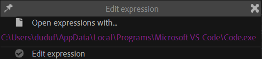

# {style="width:1em;"} Edit Expression

This is a quick way to open any expression in an external editor, for easier editing of complex expressions than the expression editor available in After Effects.

1. **Select** the property with the expression.
2. Click the {style="width:1em;"} ***Edit Expression*** button.
3. Once you're done, **save the file** in the external editor.
4. `[Ctrl] + [Click]` the {style="width:1em;"} ***Edit Expression*** button to update it in After Effects.

When the expression is open in the external editor, you can continue editing and saving the expression file as much as you need, and reload it at any time in After Effects.

By default, Duik opens the expression with the default application associated with `.js` files, but you can set the editor to use: `[Shift] + [Click]` the ***Edit Expression*** button to open the settings.

!!! tip
    We recommend using Microsoft Visual Studio Code to edit expressions.

    Its default installation path on Windows is  
    `C:\Users\YourNamme\AppData\Local\Programs\Microsoft VS Code\Code.exe`
