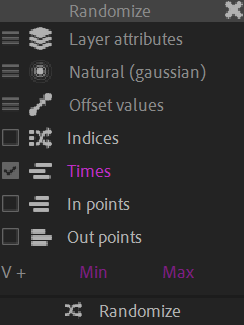

# {style="width:1em;"} Randomize

The *Randomize* tool is able to randomize all kinds of things (property values, keyframe times, layer times…)

First, open the *Randomize* panel by clicking on the {style="width:1em;"} *Randomize* button.

  
*L'enfant au toton (Portrait de Auguste Gabriel Godefroy),  
Jean-Baptiste-Siméon Chardin, 1738  
Public domain.*{style="font-size:0.8em;"}

You can choose to randomize:

- The Current values: randomizes the selected properties, adding a keyframe at the current time if the property is animated.
- The Layers: randomizes the layers times, or locatioon in the layer stack.
- The Keyframes: randomizes the selected keyframes values or times.

For all modes, you can select the mode:

- The ***Natural (gaussian distribution)* mode** feels more realistic and natural; when used in the position of layers for example, the layers will be distributed around the center of the original position, in a circular area. But with this mode, the values may jump further away than the exact amplitude.  
- The ***Strict* mode** feels less natural, but the values are strictly bounded by the given amplitude.

You can also choose if the value is added to the current state (***offset***) or if it completely replaces existing values (***absolute***).

## Current Values

If you **split** the multi-dimensional values, three axis are shown; you can just ignore the third axis if you're randomizing a 2D value. In case of colors, the three axis represent the Red, Green and Blue channels, and are ranging from `0.0` to `1.0` (or more in case of 32-bits-per-channel projects).

## Layers

- ***Indices*** move the layers up and down in the stack.
- ***Times*** move the layers in the timeline.
- ***In points*** and ***Out points*** cut the layer at the specified times, without moving them.

## Keyframes

With keyframes, you can either randomize their **times** (and move them in the timeline) or their **values**.

If you **split** the multi-dimensional values, three axis are shown; you can just ignore the third axis if you're randomizing a 2D value. In case of colors, the three axis represent the Red, Green and Blue channels, and are ranging from `0.0` to `1.0` (or more in case of 32-bits-per-channel projects).

