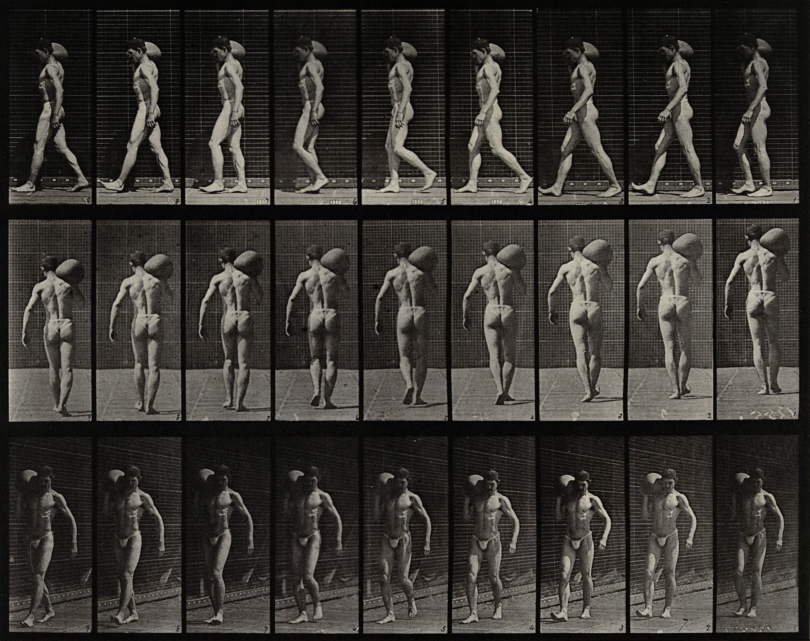

# {style="width:1em;"} Walk and Run Cycle

The *Walk  / Run Cycle* is a comprehensive procedural animation.

It’s a very quick and simple way to get started with walk and run animations. A nice walk or run cycle is just a click away, but you can go into details and adjust the character height and weight, but also every individual limb parameter and precisely set how it walks and runs…

.jpg)  
*Woman walking downstairs,  
Eadweard Muybridge, 1887   
Public domain.*{style="font-size:0.8em;"}

To use the Walk / Run cycle, you must have a rigged character. It can work with any rigged character though, even if it's not been rigged using Duik but other tools.

!!! tip
    This Walk / Run cycle was made for bipeds, but you can achieve a quadruped walk cycle using two walk cycles: one for the front legs, shoulders, neck and head, and another one for the back legs and hips. You only have to animate the tail by yourself and adjust a few settings.

## Setup

Before creating the Walk / Run cycle, make sure the character is standing straight, with the arms along the body, in a natural pose. You will still be able to move the controllers after the Walk / Run cycle has been created to adjust the pose and the look of the walk, or even animate them above the automatic animation to adjust it. The Walk / Run cycle is not meant to create perfect and characterized animation. It is a tool useful to get started quickly with walk or run animations which would need some tweaks to characterize them, or to animate quickly secondary, less important, characters.

If the character was rigged by predefined limb bones and the Auto-rig of Duik, using the Walk Cycle is pretty straightforward:

1. **Select** all the controllers of the character
2. Click on the {style="width:1em;"} ***Walk / Run Cycle*** button

If the character was rigged using custom bones in Duik, or any other tool (*Rubberhose*, *BAO Bones*, *Limber*…) or even custom expressions, you can also use the Walk / Run Cycle, but you will have to make some easy connections manually:

1. **Select** all the controllers of the character (the layers used to animate it, or which contain the effects needed to animate it)
2. Open the {style="width:1em;"} **additional panel** for the Walk / Run Cycle.  
    
3. **Assign the layers** to their corresponding limbs. The eyedropper will set the currently selected layer in the composition.  
    1. Click the {style="width:1em;"} ***Walk / Run Cycle*** button.
    2. Duik will try to link the properties of the controllers to the walk and run cycle, but if you are using custom rigs, it may not find them all, in this case, read the effect description below to see how you can connect them manually.

The Walk / Run Cycle can be adjusted in the effects of the Walk / Run cycle controller which has been created in the composition.

!!! tip
    All controllers can still be animated, so you can add your own keyframes to adjust the animation to your taste or animate anything else. Feel free to move the controllers to adjust the pose of the character.

!!! warning
    The procedural walk / run cycle animates the arms with Forward Kinematics (*FK*)[*](../../misc/glossary.md) and thus deactivates the Inverse Kinematics (*IK*)[*](../../misc/glossary.md). The position of the controllers of the arms do not control them anymore, as the animation is made on the angles of the [individual FK controls](../constraints/kinematics.md)&nbsp;[^ik].

    If you want to animate or adjust the arms, you can either adjust the values in the individual FK controls in the effects of the controllers, or you can enable again the IK, but this will deactivate the procedural animation on the arms.

    You can animate the switch between IK and FK, and Duik provides a tool to ease this [IK/FK switch](../animation/tools/ik-fk-switch.md) process in the [Animation](../animation/index.md) panel.

!!! warning
    Make sure the left and right limbs are tagged accordingly[^tags], or fix the tags before setuping the Walk / Run cycle so it recognizes correctly the sides.

## Effect

- Use the first three values to start and stop the cycle:  
    - The **General motion** controls both the walk and run cycles.
    - The **Walk** and **Run** values  control the two cycles; you can easily animate the transition from one to the other by cross-fading these values.

- The **Main parameters** are the general settings to globally customize and characterize the animation.
- You can use the **Individual limb adjustments** to further customize the cycle.
- The **Advanced parameters** can be used to tweak the cycle on a lower level.
- Some **Useful data** is exposed at the bottom of the effect.

### Main parameters

You can set the main character traits (height, energy...) with a few arbitrary values. The value have to be adjusted relatively to the character walking and running and are subjective. Changing them gives a *feeling* of height, energy, softness...

The ***softness*** controls the drag and overlapping animation[*](../../misc/glossary.md) of the limbs.

#### Walk and Run Cycles

For both cycles, you can adjust the speed at which the character is moving. This **doesn't change the speed (frequency) of the steps, but their amplitude**, as in real life: a given character will approximately always keep the same step frequency but change the amplitude of the steps to change its walking or running speed.  
Even the frequency of a run cycle and a walk cycle are similar. This being said, don't hesitate to animate the step frequency in the *Advanced parameters* section when you're animating the transition from the walk cycle to the run cycle if you feel the run cycle should be a bit faster.

There are two types of walk cycles: `Realistic` and `Dancing`. With the `Dancing` mode, the body has two bounces per step, like Mickey Mouse.

### Individual limb adjustments

For each limb, you can individually tweak each and every single part of the animation! The properties labeled ***swing*** control the rotation of the corresponding part, and the ***softness*** usually controls the drag and overlapping animation[*](../../misc/glossary.md) of the parts.

### Advanced parameters

You can use the ***Time offset*** to offset the cycle in time; this is useful for example when using the quadruped trick: apply a walk cycle to the front legs which is offset by `± 20 %` from the same walk cycle on the back legs.

Use the ***Step amplitude*** and ***frequency*** to override all other settings and control them directly.

### Useful data

The values exposed in the ***Animation data*** section are the actual animation. When setuping the Walk / Run cycle with a custom, non-Duik, rig, you can use the expression pickwhip to these values to apply the animation to specific properties (just add `+ value;` at the end of the expression generated by the pickwhip). The arms animation uses FK, you need to connect them to angle properties. The feet animation uses IK, connect them to position properties.

The ***Leg height*** parameter should have been set automatically by Duik, but with custom rigs or specific characters, you may need to adjust this so the cycle is correctly computed. It is the length of the straight leg, from angle to hip, in pixels.

Finally, some useful values are exposed in the ***Computation*** section, which may be used in your own expressions, to synchronize other parts to the cycle animation for example.

One value is especially useful: the ***Cycle duration***, which is available in seconds or frames. To render perfect loops, you can set the work area or the composition duration to this value.

  
*A man bearing load on shoulder,  
Eadweard Muybridge, 1887   
Public domain.*{style="font-size:0.8em;"}

[^ik]: *cf. [Links and Constraints](../constraints/index.md) / [Kinematics](../constraints/kinematics.md)*.

[^tags]: You can use the [Layer Manager](../tools/layers.md) or the [Controller Settings](../controllers/tools/settings.md).

