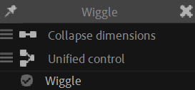

# {style="width:1em;"} Wiggle

The *Wiggle* makes the properties… wiggle.

  
*Carps,  
[Claude "Jissse" Autret](http://jissse.com){target="_blank"}  
All Rights Reserved.*{style="font-size:0.8em;"}  
*In this example, the animation is made without any keyframe, using only the Wiggle automation of Duik.*

This automation works like the standard wiggle available via the expressions of After Effects, but with more options and abilities: it can **loop** and has options to **control multiple axis** and **color channels**. The **frequency** may be **animated** too.

1. **Select** the properties
2. Click the {style="width:1em;"} ***Wiggle*** button

!!! Tip
    When you’ve applied the Wiggle on some properties and then want to use the same Wiggle on other properties, you can just copy and paste the expression in the new properties.

## Effect

The wiggle can be adjusted in the effects of the first selected layer.

!!! note
    To the contrary of the native After Effects wiggle, the frequency can be animated!

The wiggle will loop according to the ***loop duration*** set in the effect; by default the value is the duration of the composition when the wiggle is created (in seconds).

You can check the ***link dimensions*** option to use the same values on the X and Y axis; this is useful for scale properties for example.

The ***details*** section contains more advanced properties.

The ***complexity*** and ***multiplier*** values allow to have a “fractal” wiggle. This is the same as the options in the native After Effects wiggle in expressions.

The ***random seed*** is used to generate the pseudo-randomness of the wiggle.  
To the contrary of the standard wiggle in After Effects, if the ***one seed per layer*** option is unchecked, using this random seed allows to keep the wiggle as it is even if the layer is moved in the stack or when it is copied to other layers.  
To change the randomness, you can change this seed.

## Other options

Before adding the wiggle to the selected properties, you can set some options in the {style="width:1em;"} additional panel of the wiggle.

- Dimensions  
    - {style="width:1em;"} ***Collapse dimensions***: use a single amplitude and frequency for all dimensions (or channels for colors).
    - {style="width:1em;"} ***Split values***: separate amplitude and frequency values for each dimension or color channel.
- Controls  
    - {style="width:1em;"} ***Unified control***: create a single effect for all selected properties.
    - {style="width:1em;"} ***Individual controls***: create an effect for each selected property.

