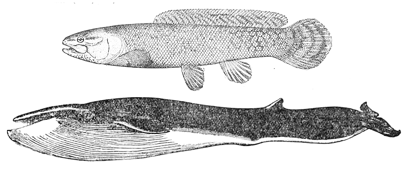
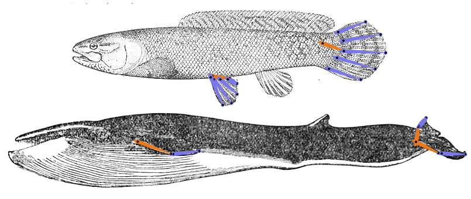

# {style="width:1em;"} Fins

Fins of fishes and whales come in very different shapes, but with Duik you can use a single and very simple Fin armature to rig any kind of fin.

This armature is made of a main bone, which will be animated using its rotation, and fishbones, which add some automatic overlapping animation so the fin bends nicely and smoothly, according to its own flexibility and the resistance of the water. There can be as many secondary fishbones as needed; a single one may be enough for simple fins such as of whales, while complex and flexible fins of tropical fishes may need a few more.

The auto-rig creates a single controller for the whole fin: most of the animation can be automated and controlled from the rotation of this controller along with a few properties in the effect of the controller.

## Fin effect

  
*The effect to control the fin.*

The fin effect contains useful settings to adjust how the automatic overlapping animation is done, in a similar way to the standard Duik [FK Controller](../../constraints/kinematics.md)[^1].

The curve property can be used to adjust the general shape of the fin, but should not be used for animation; the rotation of the controller is the main property to be animated, along with the individual *Fishbone* effects on the controller if needed, which control each fin individually for a precise and manual animation.

The *Overlap* section of the effect can be used to adjust the fin parameters, especially its flexibility and the resistance of the water. Duik will adjust the flexibility of each fishbone according to its position relatively to the main bone of the fin. Some randomness can be added to these parameters so the animation feels more natural.

[^1]: *cf.* [*Constraints / Kinematics (IK and FK)*](../../constraints/kinematics.md).

