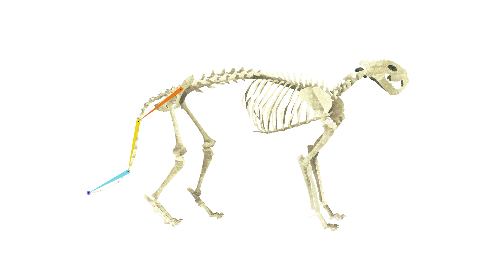

# {style="width:1em;"} {style="width:1em;"} Tails and hair

  
*This video is part of [__the official comprehensive video course about Duik Ángela__](https://rxlaboratory.org/product/the-official-comprehensive-video-course-about-duik-angela/)*

In Duik, tails, hair, and anything hanged on a character like a scarf or cloth can be rigged using a tail or hair armature.

The only difference between hair and tail rigs is that a hair rig doesn't inherit the rotation from the limb it's attached to; that helps keeping the hair (or cloth, or scarf...) hanging vertically even if the head or body rotates.

  
*A tail rigged using FK controls*

By default, hair and tails are rigged using [FK controls](../../constraints/kinematics.md); that means they're controlled by a single controller at the root of the limb, which can be animated in rotation, with a lot of options in the effects of the controller[^1].

Although most of the time it's much easier to animate these limbs with FK, you may need IK instead in very specific cases (e.g. when the dog's tail gets caught in the door. Ouch!). In this case, you can switch the *Long Chain rig* option in the settings of the auto-rig[^2].

This way the tail can be rigged using *Bézier IK* or *Bézier FK*. In this case, three controllers are added: the main controller at the tip of the tail to be animated in position, and two other controllers to have more control on the curvature of the tail[^1].

  
*A tail rigged using Bézier IK controls*

[^1]: Read the [*Constraints / Kinematics*](../../constraints/kinematics.md) section for more details about IK and FK controls.

[^2]: Read the [*Bones and Auto-Rig / Autorig / Introduction*](index.md#auto-rig-options) section for more information about the options of the Auto-rig.

