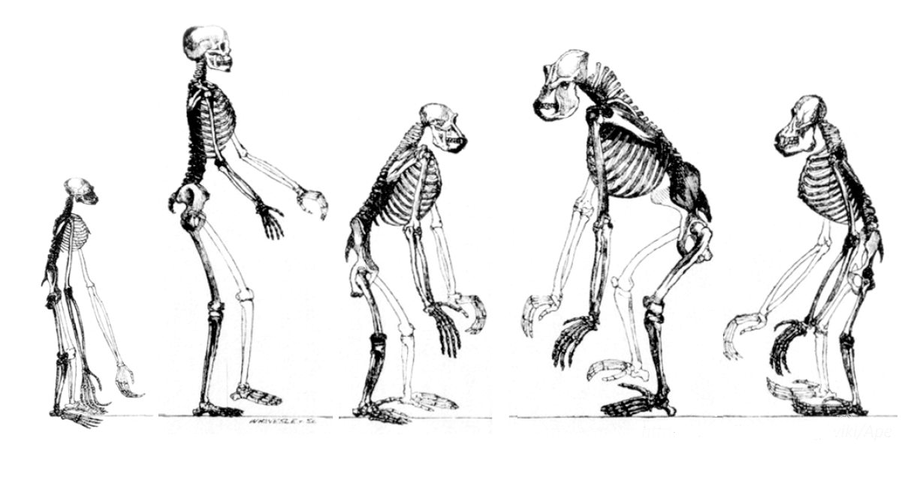
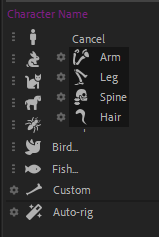

# Bones creation

  
*This video is part of [__the official comprehensive video course about Duik Ángela__](https://rxlaboratory.org/product/the-official-comprehensive-video-course-about-duik-angela/)*

With Duik, you can quickly create all kinds of predefined limbs, or some custom bones if ever the limb you're rigging is not included in these predefined armatures yet.

## Armatures for all types of animals

As there are many different types of animals, these limbs are sorted in categories.

  
*Tetrapod legs*

  
*Hominoids*

| Type | Description | Examples | Notes |
| ---- | ----------- | -------- | ----- |
| {style="width:16px;"} Hominoid[^1] | Human-like tetrapods[^2]: biped humans and apes without tails | Human, Chimpanzee, Gorilla... | Humans and their equals. |
| {style="width:16px;"} Plantigrade | Tetrapods which put the whole foot on the ground, with the heel touching the ground when they walk. | Primates, bears, rabbits… | The ones nearly equal to humans. |
| {style="width:16px;"} Digitigrade | Tetrapods which walk on their fingers. | Dogs and all canines, cats and other felines, dinosaurs, walking birds… | Human friends. |
| {style="width:16px;"} Ungulate | Tetrapods which walk on the tip of their fingers, who usually have hoofs. | Horses, cattle, girafes, pigs, deers, camels, hippopotamuses… | Food for humans. |
| {style="width:16px;"} Arthropod | Invertebrates which have more joints than tetrapods in their legs. | Spiders, scorpions, ants, crabs, bees… | Enemies of humans. |
| {style="width:16px;"} Bird | Flying digitigrades. | Sparrows and pigeons but not chickens. | |
| {style="width:16px;"} Fish | Swimming with fins. Note that Duik considers whales to be fishes too. The important thing is the way the animals move, not their actual classification. | Fishes, sharks and whales. | |

When using the [auto-rig](autorig/index.md) later, Duik will adjust the controls for each limb of each type of animal, to allow for the most detailed and easiest animation according to the animal you're animating. Read the next section for a complete description of the controls for each limb.

In these categories, for each limb you can adjust some {style="width:1em;"} options before the creation, to adapt them to your design, which makes the armatures and the auto-rig extremely versatile in Duik.

The choices you can make in these options depends on the design of your character, and especially which joints are available and where they are located.

To learn how each kind of limb may be designed and how the corresponding bones have to be located, read the [*Bones / Auto-rig*](autorig/index.md) section.

## Create armatures and bones

There are several ways to create armatures with Duik, depending on what you need. As all the other tools in Duik Ángela, **the bone creation tools try to be smart, and change their behavior depending on the context** (i.e. the current selection in the current composition).

You can create either complete characters (e.g. Humans, rabbits, etc.) using the [OCO meta-rig panel](../oco/index.md)[^3], single limbs (e.g. arms, legs, etc.), or custom armatures. Except for complete characters, the way the bones are created will change depending on the selection.

Complete characters (meta-rigs) are always built in the center of the composition, and nothing is linked to the new armature, you’ll have to create the links between the artwork and the armature by yourself later.

!!! tip
    Click the *Bone Settings* button in the toolbar of the Bones panel to access some settings, where you can change how bones are created. Read the [*Bones and Auto-rig / Tools / Settings*](tools/settings.md) section for more information about these settings.

### Without selection

Without any selection in the composition, predefined limbs and custom armatures will be created in the center of the composition.

There is a very quick way to locate the new bones where you need them though:

1. With the pen tool, `[G]`, and without any layer selected, click on the location of the bones you wish to create, from the root to the tip of the limb. This will create a new shape layer with a path, each vertex of the path located at a joint of the limb.
2. Keeping this new path selected (do not change the current tool nor click anywhere else), create the new armature with Duik.
3. Duik will automatically locate the new bones on the vertices of the path, and then remove this temporary shape layer, used only as a reference.

|     |     |     |
| --- | --- | --- |
| *1.*  | *2.*  | *3.*  |

### With a selection

With a selection, they will be moved to the selected properties or layers, and if you `[Ctrl] + [Click]` on the creation button, these selected properties or layers will be automatically parented to the newly created armature.

If **Bézier path properties** (i.e. mask path or shape path) are selected, **one armature will be created for each path**, with one bone for each vertex of the path.
Vertex and tangents will both be linked to the corresponding bone, but there is no individual control for tangents. You can create them later if you need with the [Pins](../constraints/pins.md)[^4] tool.

If **puppet pins** are selected, **one armature will be created for each layer**, with one bone for each puppet pin. The order of the bones depends on the order of the pins in the layer stack. You can re-order them before creating the armature to adjust how the armature is created and optionally how the pin is linked to it.

If **layers** are selected, without any other property, **one armature will be created**. Each bone will be moved to the corresponding layer, and the layer can optionally be parented to it.

!!! note
    If there are selected layers with their anchor points at the same location in the composition, the armature will not use the layers’ position, and layers will not be parented, to avoid weird issues happening when layers share the same anchor point in the same armature.

!!! warning
    **Never duplicate nor copy and paste bones** in After Effects, always create new armatures or use the [*Duplicate*](tools/duplicate.md) button in the bones panel of Duik.

    Internal unique identifiers are associated with the armatures, which won’t be updated when you copy or duplicate the armatures in After Effects. The Auto-rig and other rigging tools in Duik need these identifiers to work correctly and may fail if they are not set properly. The Duplicate tool does this.

[^1]: [***Hominoids***](https://en.wikipedia.org/wiki/Ape) (Hominoidea) are a branch of tailless anthropoid primates native to Africa and Southeast Asia. They are distinguished from other primates by a wider degree of freedom of motion at the shoulder joint. There are two extant branches of the superfamily Hominoidea: the gibbons, or lesser apes; and the hominids, or great apes (orangutans, gorillas, chimpanzees, humans).

[^2]: [***Tetrapods***](https://en.wikipedia.org/wiki/Tetrapod) are four-limbed vertebrate animals constituting the superclass Tetrapoda. It includes amphibians, reptiles, dinosaurs, birds, mammals and other extinct classes.

[^3]: Read the section entitled [*Meta-rigs and OCO*](../oco/index.md)

[^4]: Read the section [*Constraints / Pins*](../constraints/pins.md)