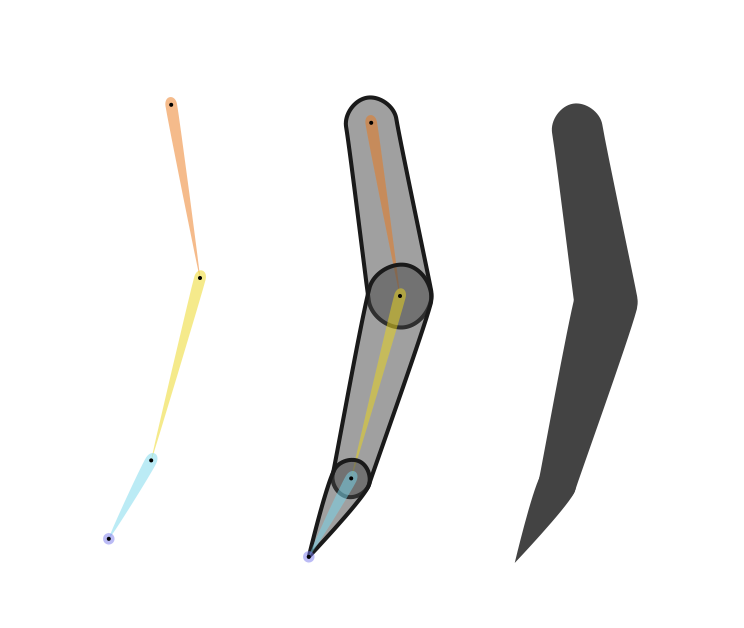
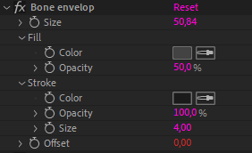

# Bone envelops

  
*This video is part of [__the official comprehensive video course about Duik Ángela__](https://rxlaboratory.org/product/the-official-comprehensive-video-course-about-duik-angela/)*

The envelops are guides included in the bone layers you can use as a reference to design precisely the joints of the limb.

!!! note
    Envelops are available only with *Full bones*. Read the [*Bones and Auto-rig / Tools / Settings*](tools/settings.md) section for more information about this setting.

They can also be used as the actual design of the character if you'd like, by just changing their opacity and color; in this case, don't forget to uncheck the *guide layer* option for these layers in After Effects, so they're rendered too when exporting the composition.

These envelops can be customized using the effect on each bone layer, and they can be activated or deactivated by just activating or deactivating the effect.

There you can adjust their size and appearance.

Use the *offset* value to offset the envelop from the joint; this is an easy way to have more detailed and realistic limbs where the pivot is not perfectly centered in the limb.

You can also set all these parameters using the [bone settings](tools/settings.md)[^1] panel in Duik.

!!! tip
    You can easily use these bone envelops as a reference for your design outside of After Effects:

    1. Unset the *guide layer* mode on the bone layers so they can be rendered.
    2. Use the `Composition ► Save Frame As ► Photoshop Layers...` menu entry in After Effects to save all the bones as a layered file which can then be imported in *Photoshop*, *Illustrator*, or *Krita* for example. You could also just render a PNG file with the alpha to be used in any other application.

Don't forget that bones are just standard shape layers (with a few expressions) and you can further customize the envelops by just modifying and adding content in the shape layer.

[^1]: Read the section [*Bones / Bone Tools / Settings*](tools/settings.md)