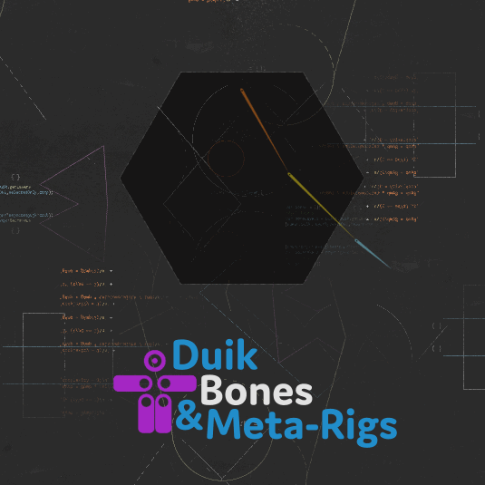

#  Bones

The bones are the core of the rigging process in Duik, both for characters and props. They're After Effects Shape layers used to drive the artwork layers. Instead of working directly on the art layers, one can work on these bones, so that the artwork won't have any expression. This allows to easily modify or replace the artwork even if it's aleady been rigged, to re-use an existing rig for multiple characters, and helps the Duik [Auto-rig](autorig/index.md) know what it has to do to build the best rig according to your type of character and limbs.

The bones come with their envelops, which are references to help you design perfectly shaped joints for your cut-out characters, and their noodles to quickly design nice, bendy, smoothly-curved limbs like if they were soft rubber. Softness can only make the world better, don’t you think?

## The Bones panel and tools

- [Create bones](create-bones.md)
- [Bone envelops](envelops.md)
- [Bone noodles](noodles.md)
- Autorig
    - [Introduction](autorig/index.md)
    - [Arms and legs](autorig/leg.md)
    - [Spines](autorig/spine.md)
    - [Tails and hair](autorig/tail.md)
    - [Wings](autorig/wing.md)
    - [Fins](autorig/fin.md)
- Tools
    - [Select bones](tools/select.md)
    - [Show/hide bones](tools/show-hide.md)
    - [Duplicate bones](tools/duplicate.md)
    - [Link art](tools/link-art.md)
    - [Edit mode](tools/edit.md)
    - [Bake bones](tools/bake.md)
    - [Bone settings](tools/settings.md)
