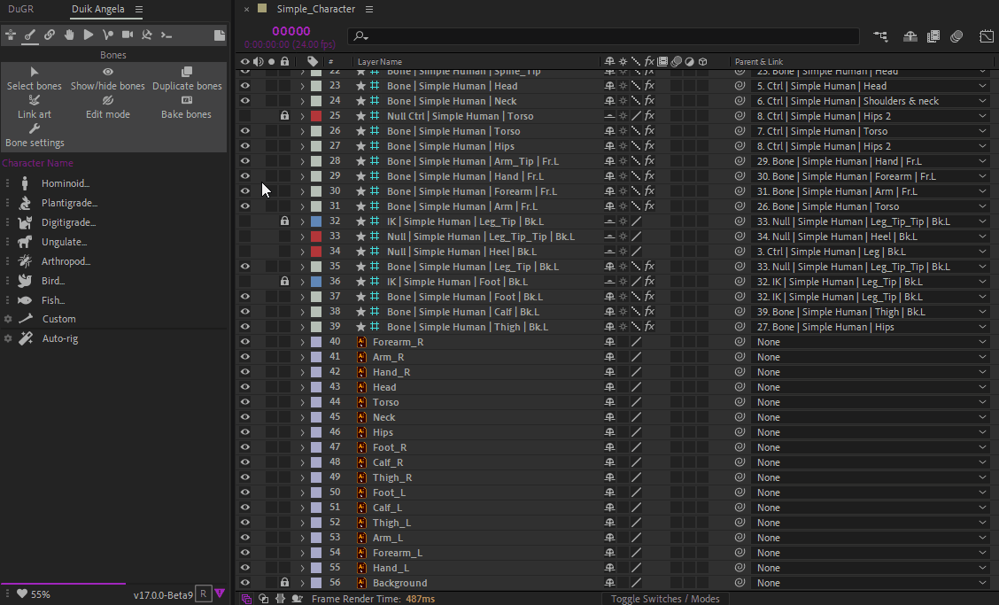

#  Link Art

The *Link Art* tool tries to automagically __parent the artwork layers and [*Duik Pins*](../../constraints/pins.md) to the bones__.

## Usage

1. *[Optional]* **Select** some layers.
2. **Click** the *Link Art* button in the [*Bones panel*](../index.md).

This is how the selection is used to determine the layers to parent:

1. If layers are selected, it will try to find the artwork layers and pins and the bones in the selection, to parent only between selected layers.
2. If there are no bones in the selection, it parents the artwork layers and pins to any bone it can find in the composition.
3. If there's no selection, it parents all artwork layers and pins in the composition to any bone it can find.

!!! tip
    Locked layers are always ignored. To quickly parent all layers except a few ones, it's faster to just lock the ones which do not need to be parented.

## Options

By default, bones are matched with artwork layers and pins by checking the distance separating them.  
Hold the `[Alt]` key when clicking the button to use the layer names instead.

### By name

This is the default behavior.

Layer names are analysed by a smart algorithm to find the corresponding bone. Duik tries to detect the side (left or right) and location (front, back...) along with the limb name and even the character name to correctly match the layers with the bones.

*Using layer names, Duik also renames the layers according to the Duik naming scheme.*

!!! note
    The limb names, sides and location will vary according to the language of the user interface of Duik, so the artwork layers and *Duik Pins* must use the same language for this feature to work correctly.

*Duik understands synonyms, and performs a* fuzzy *search to find the corresponding bones*

### By distance

Hold the `[Alt]` key when clicking the button to use the distance.

Distance between the layers and bones is measured, using the anchor points. Layers are parented to the closest bone, if and only if the distance between them is lower than the [*envelop*](../index.md) size of the bone.

  
*__OK__: The forearm will be parented to the bone.*

  
*__Wrong__: The anchor point is outside the envelop.*

  
*__Wrong__: The anchor point is too far from the anchor point of the bone*  
*(the distance is higher than the evenlop size parameter).*

