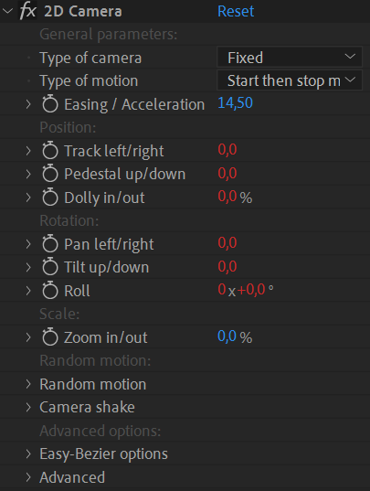
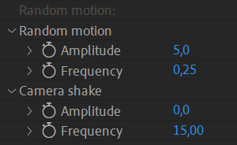

# {style="width:1em;"} 2D Camera

  
*This video is part of [__the official comprehensive video course about Duik Ángela__](https://rxlaboratory.org/product/the-official-comprehensive-video-course-about-duik-angela/)*

With 2D animation, it is usually easier to animate the positions of 2D layers than to set up a 3D space using cameras to create camera movements.

The 2D camera tool creates virtual 2D multiplane cameras to easily animate all types of camera movements, using only 2D layers[^multiplane].

[^multiplane]: This is the digital equivalent of Disney's multiplane camera (vertical setup) or the Fleischer Studios' stereoptical camera (horizontal setup) from the early days of traditional animation.

Similarly to the [Camera rig](camera-rig.md)&nbsp;[^rig], Duik also adds nice camera behaviors to these 2D cameras, to easily simulate real cameras and the way they're manipulated (hand, shoulder, tripod, etc.).

[^rig]: *cf. [Cameras](index.md) / [Camera Rig](camera-rig.md)*.

  
*Fleischer Studios' stereoptical camera,  
From the patent by Max Fleischer, "Art of Making Motion Picture Cartoons",  
1936,  
Public Domain.*{style="font-size:0.8em;"}

1. **Select** the layers corresponding to the background planes.  
    This is optional, if there are no layer selected, Duik creates a default 2D camera.
2. Click the {style="width:1em;"} ***2D Camera*** button.

Duik creates a controller for the camera, and a null layer for each background plane (or three null layers if there was no layer selected).  
Selected layers are automatically parented to these null layers.

## Levels

Each null layer controls one plane, one level of the background. In the effect of the null layer, you can adjust the **influence** of the camera with a simple slider.

The *Camera Influence*, as the name suggests, indicates how much of an impact the camera controller has on that null layer.

Camera Influence can be found in the effects of the generated or duplicated nulls. A common use case for these nulls would be to view them as planes, or “depths”.

- `0` means the level won't move at all with the camera.
- `100` means the level moves exactly at the same speed as the camera.
- `> 100` means the level is "closer" than the camera and moves faster.
- `< 0` negative values moves the level the other way than the camera; this simulates a camera rotating around a middle point in the set, which would be the level `0`.

!!! tip
    Let’s say we want to create the illusion of three dimensional space that has a main focus on the objects in the middleground (mg).

    You have a foreground (*fg*) layer, an *mg* layer, and a background (*bg*) layer.

    You would parent your *mg* layer to Level 2 since it is your primary object, the *bg* to Level 1, and the *fg* to Level 3.

    From here, you can set the camera influence of Level 1 (*bg*) to a number with a value lower than `100` (the default is `50 %`) and the camera influence of Level 3 (*fg*) to a value greater than 100 (default: `150 %`). 

    Now when you manipulate the controller, the background will move `50 %` that of the *mg* and the *fg* will move `50 %` more than the *mg*, giving the illusion of depth/parallax.

!!! Warning
    Duik will create a null called *Z* along with the 2D Camera, just ingore it and don’t try to modify, duplicate or move it. It’s needed to give the camera control it’s anchor point and some other calculations but you should not have to manipulate it by yourself.

If you need more or less layers to control other levels, you can remove or duplicate these null level layers, and just parent the actual background image layers to these null layers.

## Camera animation and effect

An effect on the main camera controller helps you animate the camera, with nice interpolations for a smooth camera move, and advanced behaviors to simulate real cameras.

### Setup

The type of camera and type of motion work similarly to the [3D Camera rig](camera-rig.md)&nbsp[^rig].

The **Type of camera** changes the behavior of the camera.  
With the **Fixed** camera, there's no random values at all, the camera perfectly follows the animation keyframes.  
With the other modes, **Handheld**, **Shoulder**, **Tripod**, **Steadicam**, Duik adds some handmade, fine tuned wiggling to the motion to perfectly simulate the way the camera is moved by the operator. Depending on the type of camera, there are different degrees of liberty for each axis, both in position and rotation, and their weight may change. Duik takes all of this into account to generate a perfect motion. This option also influences how **camera shake** is generated, all these types will shake differently, to get the most realistic motion possible.

The **Type of motion** changes the interpolation[*](../../misc/glossary.md) and extrapolation[*](../../misc/glossary.md) of the keyframes.  
To generate a perfectly smooth and realistic movement on cameras from your keyframes, Duik uses different interpolation and extrapolation algorithms[*](../../misc/glossary.md), and you just have to set the type of motion you're animating:

- **Start then stop movement**: The camera is still at the beginnning of the shot, then starts moving and stops moving before the end of the shot.
- **Start of movement**: The camera is still at the beginning of the shot, starts moving, and the shot is cut before it starts to slow down.
- **End of movement**: The camera is already moving at the beginning of the shot, slows down and stops moving.
- **Easy-Bézier interpolation**: If you'd like to manually adjust the interpolation, this mode allows for fine tuning while keeping a small number of parameters to set.
- **Linear interpolation**: To be used when the movement needs to be very regular, and if the camera is already moving at the beginning of the shot and doesn't stop at the end of the shot.
- **None (use actual keyframe interpolation)**: Deactivates the interpolation by Duik to let you use After Effects keyframe interpolation.

With all these types of motion, you can tweak the acceleration or deceleration of the camera with the **Easing / Acceleration** property. This property can be animated if you wish!

The *Easy-Bézier* options are available in the end of the effec; they're similar to the Bézier mode of the [Interpolator](../animation/tools/interpolator.md)&nbsp;[^interpolator].

[^interpolator]: *cf. [Animation](../animation/index.md) / Tools / [Interpolator](../animation/tools/interpolator.md)*.

### Camera Animation

Although you could animate directly the position of the camera controller layer, it should be easier and better to animate only from the effect, where all camera moves can be keyframed.

Duik differenciates the translation of the camera, which generate a parallax effect, from the rotation or scale which should not generate any parallax[^parallax]. Of course, you can combine all of them.

[^parallax]: That's how it works in real life; there is no change of perspective with rotations, thus no parallax effect, in an ideal setup where the pivot would be exactly at the center of the censor (and the censor would be infinitely small). As this perfect case scenario is almost impossible, there may be a very small parallax when a camera is panning, which is the result of the censor actually translating a bit too instead of just rotating.

- **Position** (with a parallax effect)  
    - **Track left/right**: horizontal translation.
    - **Pedestal up/down**: vertical translation.
    - **Dolly in/out**: depth translation (the third axis which doesn't exist in 3D, simulated using the scale of the layers).
- **Rotation** (without parallax)  
    - **Pan left/right**: horizontal rotation (*yaw*).
    - **Tilt up/down**: vertical rotation (*pitch*).
    - **Roll**: the actual 2D rotation.
- **Scale** (without parallax)
    - **Zoom in/out**: the actual 2D scale. This simulate the animation of the focal length (zoom) of the camera. If you prefer to *dolly*, with parallax, use the *dolly in/out* property.

### Random motion and camera shake

According to the *type of camera*, Duik may add some **random motion** on top of the keyframe animation, to simulate the corresponding type.

You can adjust the amplitude and frequency of this wiggling animation.

You can also animate the amplitude of the camera shake to make the camera shake at a specific time, for example as the result of an explosion, of the ground trembling or the wind...

!!! tip
    You shouldn't have to change much the frequency values which should be the same for almost all cameras.

As with all other random values, you can change the **seed** in the advanced section of the effect, to test different versions of the motion (or to make sure mutliple controllers use the same seed to generate the same motion).

