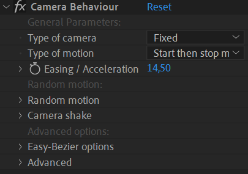
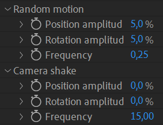

# {style="width:1em;"} Camera Rig

If you need to use 3D cameras, you can rig them in a simple way using Duik’s Camera Rig. This rig also includes camera behaviors to easily simulate real cameras and the way they're manipulated (hand, shoulder, tripod, etc.).

  
*Cinematographe Camera,  
Le Magazine du Siècle,  
Louis Poyet, 1897,  
Public Domain.*{style="font-size:0.8em;"}

This is a simple way to manipulate a two-node camera with the advantages of both a two-node and a one-node camera.

1. **Select** a **2-node** camera.  
    The rig can only be done with two-node cameras.
2. Click the {style="width:1em;"} ***Camera Rig*** button.

Duik creates three controllers:

- The main controller will control both the camera and its point of interest, actually controlling the camera as if it had only one node (without a point of interest).
- A position controller is used to control the camera only.
- And a third controller controls only the point of interest.

## Effect

An effect on the main camera controller helps you animate the camera, with nice interpolations for a smooth camera move, and advanced behaviors to simulate real cameras.

### Setup

The **Type of camera** changes the behavior of the camera.  
With the **Fixed** camera, there's no random values at all, the camera perfectly follows the animation keyframes.  
With the other modes, **Handheld**, **Shoulder**, **Tripod**, **Steadicam**, Duik adds some handmade, fine tuned wiggling to the motion to perfectly simulate the way the camera is moved by the operator. Depending on the type of camera, there are different degrees of liberty for each axis, both in position and rotation, and their weight may change. Duik takes all of this into account to generate a perfect motion. This option also influences how **camera shake** is generated, all these types will shake differently, to get the most realistic motion possible.

The **Type of motion** changes the interpolation[*](../../misc/glossary.md) and extrapolation[*](../../misc/glossary.md) of the keyframes.  
To generate a perfectly smooth and realistic movement on cameras from your keyframes, Duik uses different [interpolation and extrapolation algorithms](../../advanced/interpolation.md), and you just have to set the type of motion you're animating:

- **Start then stop movement**: The camera is still at the beginnning of the shot, then starts moving and stops moving before the end of the shot.
- **Start of movement**: The camera is still at the beginning of the shot, starts moving, and the shot is cut before it starts to slow down.
- **End of movement**: The camera is already moving at the beginning of the shot, slows down and stops moving.
- **Easy-Bézier interpolation**: If you'd like to manually adjust the interpolation, this mode allows for fine tuning while keeping a small number of parameters to set.
- **Linear interpolation**: To be used when the movement needs to be very regular, and if the camera is already moving at the beginning of the shot and doesn't stop at the end of the shot.
- **None (use actual keyframe interpolation)**: Deactivates the interpolation by Duik to let you use After Effects keyframe interpolation.

With all these types of motion, you can tweak the acceleration or deceleration of the camera with the **Easing / Acceleration** property. This property can be animated if you wish!

The *Easy-Bézier* options are available in the end of the effec; they're similar to the Bézier mode of the [Interpolator](../animation/tools/interpolator.md)&nbsp;[^interpolator].

[^interpolator]: *cf. [Animation](../animation/index.md) / Tools / [Interpolator](../animation/tools/interpolator.md)*.

### Random motion and camera shake

According to the *type of camera*, Duik may add some **random motion** on top of the keyframe animation, to simulate the corresponding type.

You can adjust the amplitude and frequency of this wiggling animation, especially for the position which depends on the size of the scene and can't be correctly set by Duik automatically.

You can also animate the amplitude of the camera shake to make the camera shake at a specific time, for example as the result of an explosion, of the ground trembling or the wind...

!!! tip
    You shouldn't have to change much the frequency values which should be the same for almost all cameras.

As with all other random values, you can change the **seed** in the advanced section of the effect, to test different versions of the motion (or to make sure mutliple controllers use the same seed to generate the same motion).
