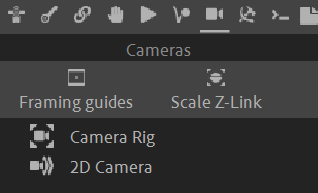

# {style="width:1em;"} Cameras

> Good animation needs a good camera. The camera has to be considered as one of the characters of the animation, and its animation has to be as detailed as the animation of the characters the spectator sees in the image.

This is the reason why Duik has useful camera tools too.

  
*Cinematographe Camera by Louis & Auguste Lumière,  
Institut Lumière   
Some rights reserved, [CC-BY-SA 4.0](https://creativecommons.org/licenses/by-sa/4.0/deed.en){target="_blank"}.*{style="font-size:0.8em;"}

## The Cameras panel

The tools in the top tool bar are quick tools you may need when animating cameras.

The main tools on the second part can be used to rig 3D cameras or create Duik 2D cameras.

## Content

- [Camera Rig](camera-rig.md/)
- [2D Camera](camera-2d.md)
- Tools  
    - [Framing Guides](tools/frame.md)
    - [Scale Z-Link](tools/scale-z-link.md)

