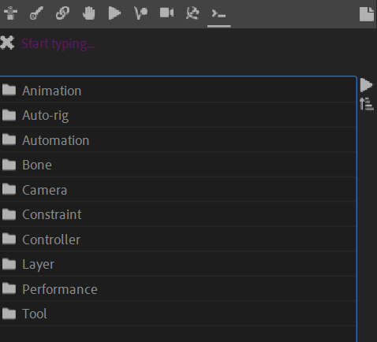

# {style="width:1em;"} Command Line

The Duik Command panel provides an command line interface (CLI) to Duik.

  
*CP/M 2.2 screenshot, running on a Sanco 8001 computer,  
Michael Specht,  
[CC-BY-SA 3.0](https://creativecommons.org/licenses/by-sa/3.0/deed.en){target="_blank"}.*{style="font-size:0.8em;"}

This is a powerful panel: you can almost use every feature of Duik with it! With its powerful auto-completion, you just have to type a few characters to use all the tools very quickly.

You can type the name of the category and commands you're looking for in the first field to quickly access them. As soon as you start typing, Duik filters the available category or commands in the list below; hit `[Space]` to quickly validate and enter the first category in the filtered list, hit `[Enter]` to run the corresponding command. If you input `..` you can get back to the parent category, which makes it very quick to navigate through all Duik commands and features.

You can also more simply use the list as a library and `[double click]` the items to navigate.

This panel can effectively replace the whole Duik interface, and is available as a very lightweight [stand alone panel](../getting-started/first-look.md#individual-panels)&nbsp;[^individual] named `Duik Cmd.jsx`.

[^individual]: *cf. Introduction / [First Look](../getting-started/first-look.md) / [Individual panels](../getting-started/first-look.md#individual-panels).