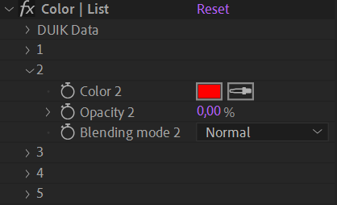

# {style="width:1em;"} List

The *List* is a simple tool to combine different animations and expressions in the same property.

To create a list, **select the property** and click on the **{style="width:1em;"} *List*** button.

If an expression was already assigned to the property, it is automatically copied into the first slot of the list, along with the existing keyframes.

The list is added in the effects of the layer. You can combine up to five animations and expressions, and then duplicate the list if ever you need more slots.

!!! note
    The result of the mix is calculated the following way  (except for colors, where the function depends on the blending mode):

    `value1 * weight1 + value2 * weight2 + value3 * weight3 + value4 * weight4 + value5 * weight5`

You can use the list with **any numerical property[*](../../../misc/glossary.md), including colors**.

!!! tip
    To use it with Bézier path properties, you can add [Duik pins](../pins.md)&nbsp;[^1] to control the path first, then use the list on the position (and rotation) properties of the pins.

When used with colors, the effect is a bit different:

Each value in the list is blended in the previous slot according to the opacity and blending mode.

!!! tip
    You can use the list to start and stop any expression, thanks to the animatable weight[*](../../../misc/glossary.md).  
    It can also be used to combine different expressions, like a sine function with multiple wiggle functions, etc.

    It's also used to connect slave properties to multiple master properties using the *[Connector](../connector.md)*&nbsp;[^2].

[^1]: *cf.* *[Constraints / Connector](../connector.md)*.

[^2]: *cf.* *[Constraints / Pins](../pins.md)*.

