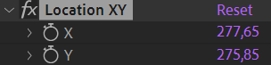

# {style="width:1em;"} Split Values

Use this tool to separate the dimensions of the selected properties. The keyframes will be copied to the separated dimensions.

Duik creates an effect with the separated dimensions.

This works on colors too! You can separate to RVB channels or HSL, and animate each channel independently.

