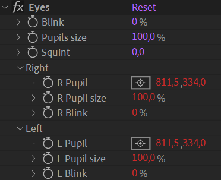

# {style="width:1em;"} Controller Pseudo-Effects

The controller pseudo-effects are simple effects which do nothing, but are pre-rigged and organized to be used with expressions or the *[Connector](../constraints/connector.md)*&nbsp;[^1] (like standard After Effects *Expression Control* effects).

!!! tip
    It's often quicker and easier to just use a simple expression to connect these effects to the corresponding properties in the rig, and the performance will be better.

    Use the *[Connector](../constraints/connector.md)*&nbsp;[^1] only for more complex animations.

## {style="width:1em;"} Eyes

This effect contains all you need to control and animate eyes.

To use it, connect the individual pupil position, pupil size and blink for the right and left eye to the actual eye position, size and blink.

The effect is already rigged to be able to animate both eyes blink, pupil sizes and squint at once.

## {style="width:1em;"} Fingers

This is a very simple effect to rotate all five fingers of a hand.

Just connect the values to the finger animations.

## {style="width:1em;"} Hand

This effect is similar to the *Fingers* effect but with a bit more details, and comes with a few expressions to be able to easily close the fist (animate all fingers at once).

To use it, connect the axis property to the opacity of different versions of the whole hand precomposition, viewed from different angles. This is a very nice way to switch the shape of the hand.  
Then you can connect the thumb property, and the four other fingers rotations to the rotations or animations of the fingers.

Thanks to the expressions, the fist will automatically rotate all the fingers.

## {style="width:1em;"} Head

People usually use a *Slider* or *2D Slider* controller to rig and conntrol head turns. Using this effect instead of these shape layer controllers will improve the performance.

Just connect the angles as you would connect the slider controllers, to the animation of the head turn.

[^1]: *cf.* *[Constraints](../constraints/index.md)* / *[Connector](../constraints/connector.md)*.

