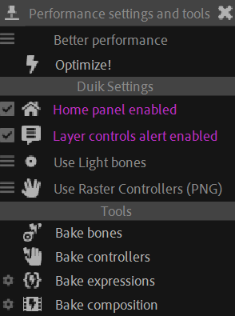

# {style="width:1em;"} Performance Panel

Performance is always an issue in After Effects.

Duik provides a popup panel to gather all performance settings and tools at the same place, to help you define the best settings to improve performance. It also provides a smart optimizer which will adjust some settings and switches to quickly improve the performance of the current composition.

## Optimizer

The first part of the panel is the simple {style="width:1em;"} ***Optimizer***.

1. **Select** a preset:  
    - Best performance
    - Better performance
    - Balanced
    - More features
2. Click the {style="width:1em;"} ***Optimize!*** button.

Depending on the preset, Duik will change some settings, and adjust some compositionn and layer parameters for the current composition.

For all presets, the Duik [*Home Panel*](settings.md) is enabled, as long as the [*Layer controls alert*](settings.md)&nbsp;[^settings].

▷ Read the section entitled *[How to improve After Effects and Duik performance](../advanced/performance.md)* to learn why we chose to apply all the following settings when optimizing the performance, and how you can further improve it.

### Best performance

With this preset, Duik tries to improve the performance as much as possible, without changing the final render.

- Duik [Bones](bones/index.md) are set to be light bones instead of full bones with envelops and noodles.
- Duik [Controllers](controllers/index.md) are set to use raster layers.
- The composition preview mode is set to `Off (final quality)`.
- The `Draft 3D` mode is enabled.
- The preview resolution of the current composition is reduced by a factor of the composition width divided by 480 (that means a quarter for 1920 pixel wide compositions).
- The motion blur and frame blending preview are disabled for the current composition.
- The preview quality of all layers is set to draft.
- The sampling quality of all layers is set to bilinear.
- The frame blending and motion blur are disabled for all guide layers and Duik specific layers (controllers, bones, pins...).

### Better performance

This preset is a bit more permissive than the *Best Performance* preset; it's the default preset as it should be the more useful in most cases.

- Duik [Bones](bones/index.md) are set to be light bones instead of full bones with envelops and noodles.
- Duik [Controllers](controllers/index.md) are set to use raster layers.
- The composition preview mode is set to `Off (final quality)`.
- The `Draft 3D` mode is enabled.
- The preview resolution of the current composition is reduced by a factor of the composition width divided by 640 (that means a third for 1920 pixel wide compositions).
- The motion blur and frame blending preview are disabled for the current composition.
- The sampling quality of all layers is set to bilinear.
- The preview quality of guide layers is set to draft.
- The frame blending and motion blur are disabled for all guide layers.

### Balanced

This preset is optimized for those who need to have more features (and a fast computer) and a better preview.

- Duik [Bones](bones/index.md) are set to be full bones with their envelops and noodles.
- Duik [Controllers](controllers/index.md) are set to use raster layers.
- The composition preview mode is set to `Off (final quality)`.
- The `Draft 3D` mode is enabled.
- The preview resolution of the current composition is reduced by a factor of the composition width divided by 960 (that means a half for 1920 pixel wide compositions).
- The motion blur and frame blending preview are disabled for the current composition.
- The frame blending and motion blur are disabled for all guide layers.

### More features

This preset only change what doesn't limit any actual feature.

- Duik [Bones](bones/index.md) are set to be full bones with their envelops and noodles.
- Duik [Controllers](controllers/index.md) are set to use shape layers in draft mode.
- The composition preview mode is set to `Off (final quality)`.

## Duik settings

In this section are gathered all settings relative to performance in Duik. Some are general settings, others may be specific to some tools, but all are also available in other panels of Duik; read the corresponding sections for more details about them.

## Tools

In this section are gathered all the tools which help to improve the performance of Duik and After Effects. They're mostly baking tools built to replace expressions by their values or keyframes. All these tools are also available in other panels of Duik; read the corresponding sections for more details about them.

[^settings]: *cf.* *Miscellaneous Tools / [Settings](settings.md)*.