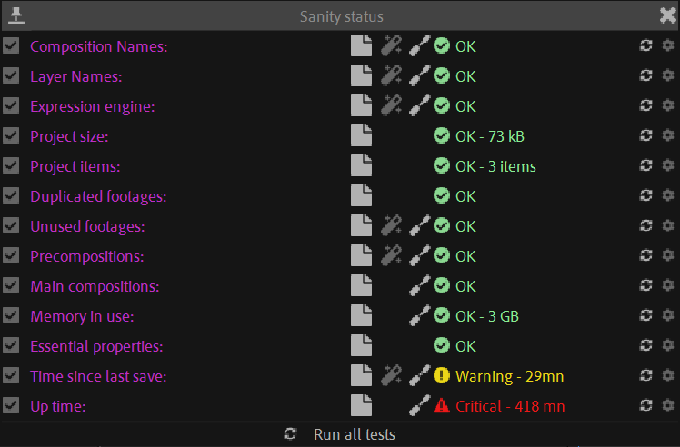

# {style="width:1em;"} Sanity Tests

Duik displays the project Sanity level through the bottom right icon. It runs a few tests regularly and changes the color of the icon depending on the results.

- {style="width:1em;"} OK
- {style="width:1em;"} Information
- {style="width:1em;"} Warning
- {style="width:1em;"} Danger
- {style="width:1em;"} Critical
- {style="width:1em;"} Fatal

Click on the icon to display the detailed results of the tests. You can enable and disable the tests globally or only for the current project, and (auto)fix issues for some specific tests.

You can also adjust each test settings with the  right-hand options button, especially set different limits for warnings, according to your own needs.

▷ Many of these tests help you keep an optimal performance. Read the *Advanced / [Performance](../advanced/performance.md)* section for more details.

- ***Composition Names***: Checks if all compositions have a unique name. This is important to make sure expressions won't break.
- ***Layer Names***: Checks if all the layers in the active composition have a unique name. This is important to make sure expressions won't break.
- ***Expression Engine***: Checks if the current expression engine is the *JavaScript* engine.
- ***Project Size***: Makes sure the project doesn't get too big, to ensure optimal performance.
- ***Project Items***: Checks if there aren't too many items in the project, to ensure optimal performance.
- ***Duplicated Footages***: Makes sure there aren't footages imported twice or more. In this case, you should replace all instances with the same item, and remove unused items from the project.
- ***Unused Footages***: Makes sure there aren't any unused footages in the project. In this case, you should reduce the project.
- ***Precompositions***: To keep the project tidy, there shouldn't be any precomposition in the root of the project panel, they should all be stored in subfolders, keeping only main compositions in the root.
- ***Main Compositions***: Main compositions are *unused* compositions, compositions which are *not* precompositions, and which are meant to be rendered in the end. They should all be gathered in the same folder (or the project root), and their number should be limited. Otherwise it's a sign the project may be reduced.
- ***Memory in Use***: The memory in use by After Effects is constantly growing. When it gets too high, it may be time to purge the memory. Be careful, because of After Effects memory leaks, the value displayed here is not accurate: leaked memory isn't tracked.
- ***Essential Properties***: Checks the number of essential properties in the current composition. Too many essential properties have a big hit on performance.
- ***Time since last save***: Save your job before your computer crashes!
- ***Up time***: For performance reasons, and because of memory leaks, it is important to restart After Effects (and your computer!) regularly.

When possible, the {style="width:1em;"} *Fix Now* button automatically fix the issues in a single click.

