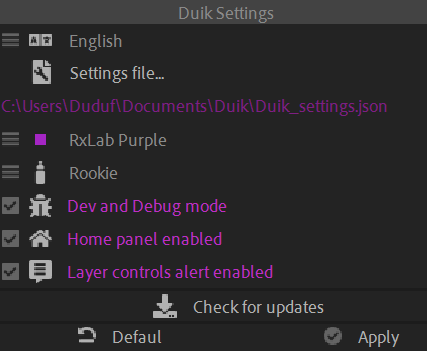

# {style="width:1em;"} Settings

  
*This video is part of __the official comprehensive video course about Duik Ángela__*

- Duik comes in many **languages**, and you can easily contribute to add more. Come on [translate.rxlab.io](http://translate.rxlab.io)!
- You can **change the location of the file** where Duik stores its settings. This may be useful to synchronize it across different computers for example.
- **Changing the color** of the UI of Duik is just cosmetic. But we love this!
- There are **three UI modes**:
    - **Rookie** takes more room and has a lot of text, but is nice for discoverability.
    - **Standard** takes a bit less room, while still keeping useful titles.
    - **Expert** removes a lot of stuff to make the UI as small and unintrusive as possible.
    - The *God* mode from Duik Bassel was removed, sorry! We loved it, but now the **Expert** mode is small enough.
- You should only switch to the **Dev and Debug** mode of Duik if you're developing stuff for Duik or if you stumble upon a bug, to get more information about the issue. In this mode, Duik will shout at you each time it encounters the tiniest bug.
- Don't disable the *Home Panel* as this may kill the performance.
- Before running complex processes, by default Duik asks you to **hide the layer handles** to make things (much) faster. If you find this annoying, or if you just never enable the layer handles, like a true pro, you can disable these alerts.

Don't forget to update Duik! We release updates quite regularly to fix bugs and improve the performance, while also adding new stuff.