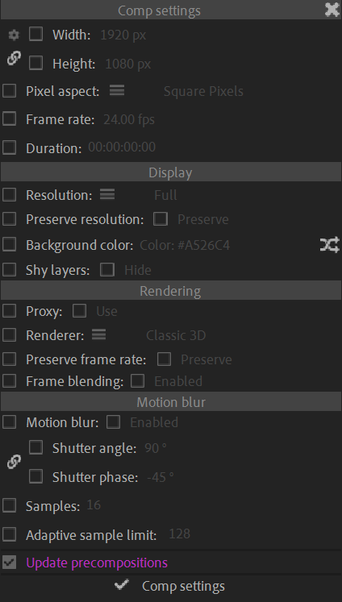

# {style="width:1em;"} Composition settings

Use this panel to change the parameters of multiple compositions at once; it is also able to automatically adjust the parameters of all the nested precompositions, and the duration of their layers.

1. **Check the box next to the setting** you'd like to change
2. **Set the value** to apply
3. Click the {style="width:1em;"} ***Comp settings*** button.

!!! note
    When changing the duration of the compositions, all layers ending with the composition (not the layers cut before the end) have their duration automatically updated too if possible (i.e. still images, solids, shapes, footage with enough duration, etc.).

