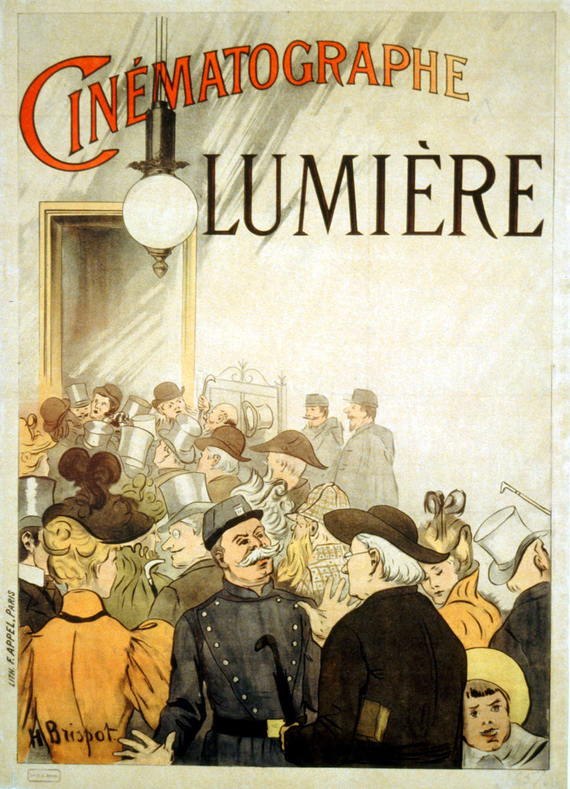
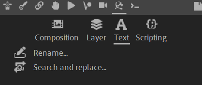

# {style="width:1em;"} General Tools

  
*Poster advertising the Lumière brothers cinematograph in Paris,  
Henri Brispot, 1895,  
Public domain.*{style="font-size:0.8em;"}

The {style="width:1em;"}[^communist] tools panel gathers miscellaneous tools not necessarilly directly related to rigging and animation but which may be useful very often.

[^communist]: Because we've received a few (very) negative criticisms (or insults) about the use of this icon, a note about it may reassure the people offended by it.

    First, this icon was used as a nod to the fact I, the developer of Duik, was always said to be a communist, by my friends and actually all the people I met. The most observative of you will notice the icon is actually a mirrored version of the hammer and sickle communist symbol, and not an exact copy.

    It is true I believe the class struggle is very real, and capitalism and mercantilism have to end. That's one of the reason why Duik is free, after all! And I've received more thanks than insults for that, which is heartwarming.

    But more importantly, there's no reason to be offended by it. Some commenters compared the hammer and sickle icon in Duik to the use of the swastika by the nazis, but there's nothing comparable here; it's ignorance which led these people to associate the hammer and sickle to Stalin and stalinism. It's ignorance which leads to conflate stalinism and communism. Thus using the hammer and sickle communist symbol is not endorsing stalinism or even leninism at all.

    Stalinism, also called marxism-leninism, was actually state capitalism; this doctrine is far from actual marxism and communism, which existed for almost a century before Stalin took power in the Soviet Russia and continued to exist after the fall of the Soviet Union. I believe it's capitalist propaganda which hammered in people's education than stalinism and the Soviet Union is communism, thus nearly as bad as nazism. Sadly, this is far from true, and I can't stress enough the importance of learning what communism and anarchism really are.

    Back to the symbol. Although the hammer and sickle became used by the Russian Soviet Federative Socialist Republic in 1924, it was already used before, during the 1917 Russian Revolution.

    The hammer stands for the industrial working class and the sickle represents the agricultural workers, uniting the two groups, which made sense to represent the working class as a whole during the Russian revolution. It's become an adequate symbol of the class struggle which is a central tenet in the philosophies of Karl Marx (communism) and Mikhail Bakunin (anarchism). Yes, I do believe the class struggle is still very relevant today, unfortunately.

    As a symbol of communsim it was not only used (perverted) by Stalin, but also by his very opponents; it's engraved on Leon Trotsky's gravestone in Mexico, who was one of the most important marxist opponent to stalin and was expelled from the Soviet Union in 1929.

It's separated into four tabs:

- **Composition**  
      
    - [**Crop precompositions**](composition/crop.md)
    - [**Comp. settings**](composition/settings.md)
- [**Layer**](layers.md)  
    
- **Text**  
      
    - [**Rename**](text/rename.md)
    - [**Search and Replace**](text/search-replace.md)
- **Scripting and Expressions**  
      
    - [**Script Library**](scripting/library.md)
    - [**Scriptify expression**](scripting/scriptify-expression.md)
    - [**Script editor**](scripting/script-editor.md)
    - [**Edit expression**](scripting/edit-expression.md)
