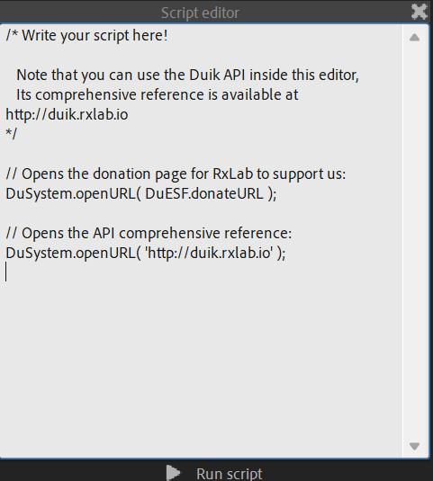

# {style="width:1em;"} Script Editor

The Script Editor is a very simple text editor to let you quickly write or edit simple scripts and run them right from After Effects.  
This is very useful to automate repetitive tasks if you know a bit of scripting in After Effects.

From this editor, the complete [Duik API](../../../advanced/api/index.md) is already included and can be used to automate tasks even more easily.

▷ Read the Avanced / [Duik API](../../../advanced/api/index.md) section for more information and examples about how to use the API to write your own scripts.

