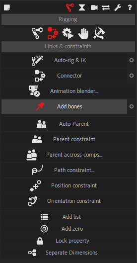

#  Bones

Bones are a very simple yet extremely useful tool. They are layers used to control any spatial property or bezier shape.

## Creation

1. Select the properties
2. - Click on the _Bones_ button
    - Maintaining the [Alt] key will pick a random color for the new bones
    - Maintaining the [Ctrl] key will will ignore the tangents when creating bones on bezier paths

!!! hint
    You can remove bone layers and recreate them at any time.  
    This is especially useful when rigging bezier paths where you do not need to rig all the tangents: you can either remove the ones you don't need, or create them later.  
    To create missing tangents on a bezier path, select the corresponding tangent _in the effects_ of the layer containing the path, and then click the _Bones_ button.

One bone will be created for each selected spatial property and for each vertex and tangent of selected Bezier paths.  
Bones can be used to control puppet pins, but also for example the emitter of a particle system, the origin of a lens flare, and any Bezier paths (shapes or masks).

!!! note
    Bones work on Bezier path only in After Effects CC2018 and newer.

When the property is controlled by a bone, you can rig the bone itself, parent it to other layers (and *Structures* of Duik), etc. which make rigging effects very easy. This is the easiest way to rig a character with the puppet tool of After Effects, or even a way to rig directly the shapes used to draw the character.

## Bone types

### Standard spatial properties

screenshot sur une propriete standard

When used on standard property, the coordinates of the property will be connected to the bone so the position of the bone controls the property. The bone can then be parented or rigged with any other tool, as any layer.

### Puppet tool

screenshot des trois types de bones puppet

Bones can be used with both the legacy puppet engine and the advanced one. When used on the legacy engine, or with position pins and the advanced engine, the position of the bones will control the pins, exactly as if you were using any other standard spatial property.
When used with the other types of pins (bend and advanced), Duik will automatically detect the type of the selected puppet pins and create bones accordingly, and the rotation and scale properties of the bones will also control the rotation and scale of the pins.

### Bezier paths

scrennshot d'un path et bones

When used with Bezier paths, Duik will create bones both for vertices and tangents. By default, the tangents are parented to their corresponding vertices, and you can animate and rig the rotation and scale of the bones for the vertices to easily control the tangents. It can especially be useful in conjunction with the _orientation constraint_ for example (see the corresponding section later in this _Constraints_ chapter).

## Edit Bones

!!! hint
    Available in _Standard_ and _Expert_ modes only.

In the additionnal panel of the Bones, you can adjust their appearance.
All changes made in this panel will affect all selected Bones and the creation of all other Bones.

- You can change the size of the Bones, either automatically, relatively to the size of the composition (small, medium and large options), or with an absolute value (custom option).

- You can change the color of the Bones: if you click on the colored label, a color picker will be shown, but you can also set your own hexadecimal color code in the text field. A random button will set a random color.

- You can pick the selected Bone appearance with the "Get" button, and set the parameters to the selection with the "Set" button.

- The "Bake Appearance" button will remove all expressions used by the Bones to set their appearance. This will improve the performance of the rig, but you will not be able to change the appearance afterwards.
