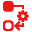

##  Constraints

> _The interaction between the controllers and the Structures, and between the Structures themselves, happens through some constraints. **Some of them are the core tools of Duik since the first version**, like **IK** which drive the bending of limbs, and the **Bones** which are used to control any spatial property: puppet pins, the emitter of a particle effect, and, now in Duik Bassel with CC2018 and newer versions of After Effects, any Bézier value, like shapes or masks._

The ***Constraints*** panel contains all necessary tools to rig characters, props, animations in After Effects.  
These are the tools you can use after you have created some Structures, to make them move as you wish, and manipulate them with handy controllers.

## Panel

The constraints panel.

## Tools

-  ***[Autorig & IK](autorig.md)*** are (automated) tools mostly used to rig humans and animals.
-  The ***[Connector](connector.md)*** is a way to control almost any property in After Effects with any other property, a bit like parenting between layers.
-  The ***[Animation Blender](animation-blender-setup.md)*** is a tool to animate using markers to trigger animations.
-  The [***Bones***](bones.md) are layers used to control spatial properties of effects (including the puppet tool pins, but not only them), or Bézier shapes since After Effects CC2018, allowing to use parenting, expressions and the other rigging tools with them, from Duik or any other script.
-  The [***Auto-Parent***](auto-parent.md) tool helps you parent layers very quickly.
-  The [***Parent Link***](parent-constraint.md) tool replaces the native parenting of After Effects and allows to animate those links.
-  ***[Parent Accross Comps](parent-accross-compositions.md)*** is a way to simulate parenting a layer to another one in a parent composition or in a precomposition.
-  The [***Path Constraint***](path-constraint.md) constraints the position of a layer to any Bézier path (CC2018 and up only)
-  The [***Position Constraint***](position-constraint.md) links the position of a layer to the positions of other layers.
-  The [***Orientation Constraint***](orientation-constraint.md) links the rotation of a layer to the orientations of other layers.
-  The [***List***](duik-list.md) tool is a nice way to combine animations or expressions on the same property.
-  The [***Zero***](zero.md) is a layer used to zero out transformations of another layer.
-  [***Separate Dimensions***](separate-dimensions.md) allows you to separate X and Y positions.