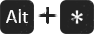

#  Animation Blender

The Animation Blender is a tool to animate using markers to trigger animations.

!!! note
    To use it, the animated properties or composition which have to be triggerd by markers have to be set up beforehand.
    [The tools to prepare the Animation Blender](animation-blender-setup.md) are located in the Rigging panel, in the Constraints tab.

Once it is set up, you just have to add markers named after the animation you want to trigger on the blender controller layer.  
You can do it manually directly inside After Effects (see the shortcuts below), or with the Animation Blender tool which will list all available animations for you:  
Select the animation you want in the dropdown list, then click the "Set" button.  
There is a "Refresh" button in case the animation list is not up-to-date.

## Shortcuts for markers in After Effects

!!! caution
    Some of these shortcuts were not available in all versions of After Effects, but were added in the latest versions.

-  adds a new marker on the selected layer, or on the composition without any selected layer.
>
-  opens the marker editor window before adding the marker, where you can set a comment.
>
-  on a marker changes its duration.
>
-  on a marker removes it.
>
-  adds a marker with the corresponding number as its comment.
