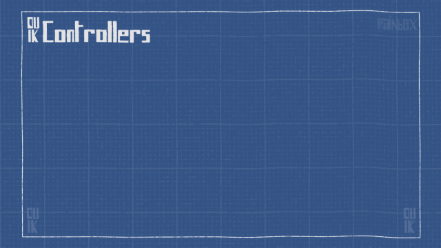

#  Controllers

As the controllers are going to be the interface between the animator and the character, they have to be intuitive and easy to manipulate. That’s why Duik Bassel not only introduces new shapes to make them easier to recognize, but there is also visual feedback on the controllers to see what the controllers are doing! And of course, they can be easily personalized, you can change their colors and shapes as you wish.

## Panel

  
This is the Controllers panel in *Normal* mode.

The controller panel consists of the list of controllers shapes you can use in your rigs (or which are created with the tools like the Auto-rig), and some useful tools related to controllers.

There are 3 special shapes: the slider, the 2D slider and the angle controllers. They are not meant to be used like other controllers - with parenting or IKs, etc. - but with the "Connector" or expressions: it is easy to get and connect their value to any other property and control almost anything you want with them, in a very visual and easy way.

!!! hint
    Controllers are standard shape layers. You can draw anything you want in the content of a controller, therefore using custom shapes is possible.

The bottom right button creates a null layer instead of a Shape layer to be used as a controller.

## Shortcuts

- **[Click]** on a controller in the panel to create one per selected layer in the composition. Each controller will be located at the anchor point of the corresponding layer.
- Hold **[Alt]** when clicking to create only one controller centered in all the selected layers in the composition.
- Hold **[Ctrl]** when clicking to auyomatically parent the layer(s) to the new controller(s)
- You can combine **[Alt] + [Ctrl]** to create only one controller and parent the layers.

!!! tip
    Controllers created as Null layers will be 3D layers if the corresponding selected layer in the composition is a 3D Layer.