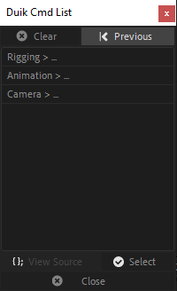

The *Duik Cmd* panel provides an command line interface (CLI) to Duik.

This is a very small yet powerful panel: you can almost use every feature of Duik with it! With its powerful auto-completion, you just have to type a few characters to use all the tools very quickly.

When learning to use it, you may find the list of all the functions useful. Click on the list icon to open it.

Just double-click on an item to open the section or run the corresponding source code.
The *View Source* button will show you the code used to launch the corresponding function. This code is available through the [Duik API](duik-api.md) if you're interested to easily include some features in your own scripts.